# Learning Database — Spring Boot + PostgreSQL

A self-contained learning project covering **SQL interview questions** and every major **Spring Data JPA concept**.  
All tables are created and seeded automatically by Flyway on startup.

## Why this project exists

Most tutorials teach JPA or SQL in isolation, with toy examples that never touch the messy edges you actually run into in production: what happens when two transactions update the same row at the same time, why a perfectly reasonable-looking loop over a `@OneToMany` collection quietly turns into hundreds of SQL statements, or why an `INSERT` inside a rolled-back transaction can still leave an audit trail behind. This repository is built the other way around: every concept below is backed by a real, runnable table, entity, repository, or service class in `src/main/java`, seeded by a real Flyway migration in `src/main/resources/db/migration`. Nothing in this document describes a feature that isn't present in the code — every code block is either copied verbatim from a source file (with the exact file and line range noted) or is the literal SQL Hibernate/Flyway generates for that code.

The project sits at the intersection of three layers that most JPA discussions blur together:

1. **The relational model** — how PostgreSQL physically stores rows, indexes, and constraints (Flyway migrations `V1`–`V10`).
2. **The ORM mapping layer** — how Hibernate/JPA annotations translate Java object graphs into that relational model, and the leaks in that abstraction (N+1 queries, locking, inheritance, auditing).
3. **The transactional/concurrency layer** — what guarantees the database gives you when multiple requests touch the same data concurrently, and how Spring's `@Transactional` exposes (and sometimes hides) those guarantees.

### Architecture at a glance

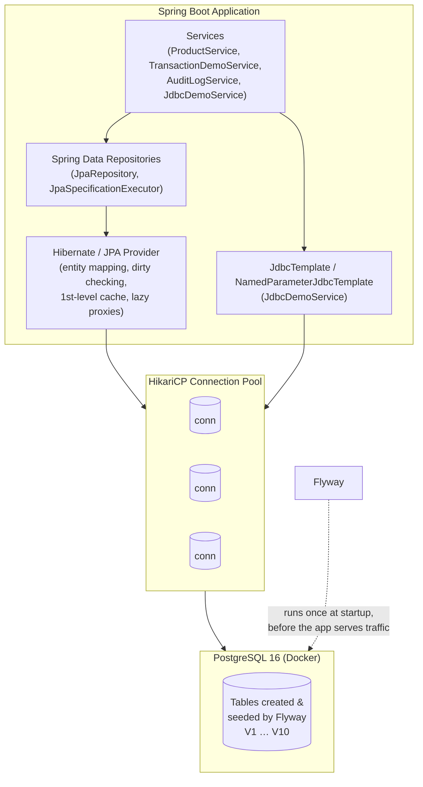

At startup, Flyway inspects `db/migration`, compares each script's checksum against a `flyway_schema_history` table it maintains inside `learningdb`, and applies any migration that hasn't run yet — in strict version order (`V1` → `V10`). Only after all migrations succeed does Spring Boot finish context initialization and start accepting requests. Every table, index, function, and seed row you see in this document is produced by that process — there is no manual setup step.

---

## Table of Contents

1. [Quick Start](#1-quick-start)
2. [Project Structure](#2-project-structure)
3. [Flyway Migrations](#3-flyway-migrations)
4. [SQL Interview Query Problems](#4-sql-interview-query-problems)
   - Q1 Employee & Department — JOIN, GROUP BY, MAX
   - Q2 HAVING vs WHERE
   - Q3 ROW_NUMBER vs RANK vs DENSE_RANK
   - Q4 Nth Highest Salary
   - Q5 Nth Highest Salary with Index
   - Q6 Pivot Table
   - Q7 Swap Two Columns
   - Q8 NTILE()
   - Q9 LAG() and LEAD()
   - Q10 Kth Rating in a Restaurant
5. [Spring Data JPA Concepts](#5-spring-data-jpa-concepts)
   - 5.1 Spring Data Overview
   - 5.2 JPA vs Hibernate
   - 5.3 CrudRepository vs JpaRepository
   - 5.4 Relationships & Associations
   - 5.5 Cascade Types
   - 5.6 Fetch Types & N+1 Problem
   - 5.7 @JoinColumn vs @JoinTable
   - 5.8 OrphanRemoval vs CascadeType.REMOVE
   - 5.9 Inheritance Strategies
   - 5.10 Projections
   - 5.11 Dynamic Queries — JPA Specification
   - 5.12 Dynamic Queries — Query By Example (QBE)
   - 5.13 @Embeddable & @EmbeddedId (Composite Keys)
   - 5.14 Spring Data Auditing
   - 5.15 Soft Delete
   - 5.16 Paging, Sorting & Slicing
   - 5.17 Stored Procedures & DB Functions
   - 5.18 JDBC — RowMapper, ResultSetExtractor, RowCallbackHandler
   - 5.19 NamedParameterJdbcTemplate
   - 5.20 Connection Pool (HikariCP)
   - 5.21 @EntityGraph — Eager-Loading Graphs
   - 5.22 @Lock — Pessimistic & Optimistic Locking
   - 5.23 @Modifying — Bulk UPDATE / DELETE
   - 5.24 @Transactional — Propagation, Isolation, rollbackFor, timeout
   - 5.25 Window / ScrollPosition API (Keyset Pagination)
   - 5.26 @SQLRestriction vs @Filter (Soft Delete Approaches)
   - 5.27 @Convert / AttributeConverter
   - 5.28 @Formula — Computed Columns
   - 5.29 @BatchSize and @Fetch(SUBSELECT) — N+1 Alternatives
   - 5.30 Jackson Serialization — @JsonManagedReference / @JsonBackReference / @JsonIgnoreProperties
   - 5.31 JdbcTemplate.batchUpdate()
6. [Database Schema Overview](#6-database-schema-overview)
7. [Connect to the Database](#7-connect-to-the-database)

---

## 1. Quick Start

### Prerequisites
- Docker & Docker Compose
- Java 17+ (project uses Java 17 source level; tested with Java 26)
- Maven 3.8+

### Steps

```bash
# 1. Start PostgreSQL
docker compose up -d

# 2. Run Spring Boot (Flyway runs migrations automatically)
mvn spring-boot:run

# 3. Application starts on http://localhost:8080
```

> Flyway runs **V1 → V10** migrations on startup, creating all tables and seeding all sample data.  
> Open `interview-queries.sql` in any SQL client and run the queries against `learningdb`.

### Database Connection Details

| Property | Value |
|---|---|
| Host | `localhost` |
| Port | `5432` |
| Database | `learningdb` |
| Username | `postgres` |
| Password | `postgres` |

---

## 2. Project Structure

```
learning-database/
│
├── docker-compose.yml                    ← PostgreSQL 16
├── interview-queries.sql                 ← All 10 interview queries ready to run
├── pom.xml
│
└── src/main/
    ├── resources/
    │   ├── application.yml               ← DB config + JPA + HikariCP
    │   └── db/migration/
    │       ├── V1__create_departments.sql
    │       ├── V2__create_employees.sql
    │       ├── V3__create_emp_test.sql
    │       ├── V4__create_scores.sql
    │       ├── V5__create_deliveries.sql
    │       ├── V6__jpa_relationship_tables.sql
    │       ├── V7__jpa_inheritance_tables.sql
    │       ├── V8__jpa_other_tables.sql
    │       ├── V9__stored_procedures.sql
    │       └── V10__additional_columns.sql
    │
    └── java/com/learning/database/
        │
        ├── config/
        │   └── AuditConfig.java              ← @EnableJpaAuditing + AuditorAware
        │
        ├── entity/
        │   ├── common/
        │   │   └── AuditableBase.java        ← @MappedSuperclass: @CreatedDate, @LastModifiedDate, @Version
        │   │
        │   ├── converter/
        │   │   ├── Priority.java             ← Enum (LOW/NORMAL/HIGH) with stable DB values
        │   │   └── PriorityConverter.java    ← @Converter(autoApply=true) Priority ↔ VARCHAR
        │   │
        │   ├── interview/                    ← Map to existing V1/V2 tables
        │   │   ├── DepartmentEntity.java     ← @Formula, @BatchSize, @JsonManagedReference
        │   │   └── EmployeeEntity.java       ← @NamedEntityGraph, @NamedStoredProcedureQuery, @JsonBackReference
        │   │
        │   ├── relationship/
        │   │   ├── AddressEntity.java        ← @OneToOne inverse
        │   │   ├── UserEntity.java           ← @OneToOne owning (holds address_id FK)
        │   │   ├── CustomerEntity.java       ← @OneToMany + @JsonManagedReference
        │   │   ├── OrderEntity.java          ← @ManyToOne + @JsonBackReference
        │   │   ├── StudentEntity.java        ← @ManyToMany owning + @JsonIgnoreProperties
        │   │   └── CourseEntity.java         ← @ManyToMany inverse + @JsonIgnoreProperties
        │   │
        │   ├── inheritance/
        │   │   ├── VehicleEntity.java        ← SINGLE_TABLE base (@DiscriminatorColumn)
        │   │   ├── CarEntity.java            ← @DiscriminatorValue("Car")
        │   │   ├── MotorcycleEntity.java     ← @DiscriminatorValue("Motorcycle")
        │   │   ├── PaymentEntity.java        ← JOINED base
        │   │   ├── CreditCardPaymentEntity.java
        │   │   ├── BankTransferPaymentEntity.java
        │   │   ├── DeviceBase.java           ← @MappedSuperclass (no table)
        │   │   ├── ComputerEntity.java       ← own table, inherits DeviceBase
        │   │   ├── MobilePhoneEntity.java    ← own table, inherits DeviceBase
        │   │   ├── AnimalEntity.java         ← TABLE_PER_CLASS base
        │   │   ├── DogEntity.java
        │   │   └── CatEntity.java
        │   │
        │   ├── embeddable/
        │   │   ├── OrderItemId.java          ← @Embeddable composite key
        │   │   └── OrderItemEntity.java      ← @EmbeddedId
        │   │
        │   └── softdelete/
        │       ├── ProductEntity.java        ← @SQLDelete + @Filter + @Convert(Priority) + AuditableBase
        │       └── StockItemEntity.java      ← @SQLDelete + @SQLRestriction (always-on, simpler)
        │
        ├── projection/
        │   ├── EmployeeNameView.java         ← Interface projection (Spring proxy)
        │   └── EmployeeSummaryDTO.java       ← DTO / record projection
        │
        ├── repository/
        │   ├── DepartmentRepository.java     ← JOIN FETCH demo
        │   ├── EmployeeRepository.java       ← @EntityGraph, @Lock, @Modifying, Window, @Procedure
        │   ├── UserRepository.java
        │   ├── CustomerRepository.java
        │   ├── CourseRepository.java         ← JOIN FETCH, enrollment counts
        │   ├── StudentRepository.java
        │   ├── VehicleRepository.java        ← Polymorphic SINGLE_TABLE queries
        │   ├── PaymentRepository.java        ← Polymorphic JOINED queries
        │   ├── ComputerRepository.java
        │   ├── AnimalRepository.java         ← Polymorphic TABLE_PER_CLASS (UNION ALL)
        │   ├── OrderItemRepository.java      ← Composite key lookup
        │   ├── StockItemRepository.java      ← @SQLRestriction demo
        │   └── ProductRepository.java        ← JpaSpecificationExecutor + @Modifying + Window
        │
        ├── service/
        │   ├── ProductService.java           ← Soft delete, Spec, QBE, Paging, Window, @Modifying
        │   ├── TransactionDemoService.java   ← All 7 propagation types + 4 isolation levels
        │   ├── AuditLogService.java          ← REQUIRES_NEW audit log demo
        │   └── JdbcDemoService.java          ← RowMapper, ResultSetExtractor, batchUpdate
        │
        └── specification/
            └── ProductSpecification.java     ← Composable Specification predicates
```

---

## 3. Flyway Migrations

Flyway is a **schema-as-code / migration-based** tool: instead of a DBA hand-editing the schema (or an ORM's `ddl-auto=update` silently guessing at changes), every structural change to the database is captured as an immutable, version-numbered SQL script committed to source control alongside the application code. This matters for a few concrete reasons this repo actually exercises:

- **Reproducibility** — anyone who clones the repo and runs `docker compose up -d && mvn spring-boot:run` gets byte-for-byte the same schema and seed data, because the migrations are the single source of truth (see `V1`–`V10` below).
- **Auditability** — Flyway records every applied migration, its checksum, and its execution time in a `flyway_schema_history` table. If a script is edited after being applied, the checksum mismatch causes the next startup to fail loudly rather than silently drift.
- **Safe incremental evolution** — `V10__additional_columns.sql` demonstrates this directly: rather than rewriting `V8`'s `product` table definition, a brand-new migration *adds* a `priority` column and a new `stock_item` table. Production schemas are never edited retroactively; they only move forward.
- **Ordering guarantees** — migrations are versioned (`V1`, `V2`, … `V10`) so dependent objects are always created after what they depend on. `V6` (relationship tables) must run before any entity referencing `jpa_customer`/`jpa_order` can be persisted; `V9` (stored procedures) references columns created back in `V2`.

```mermaid
flowchart LR
    START(["App starts"]) --> CHECK{"flyway_schema_history\ntable exists?"}
    CHECK -- "no" --> CREATE["Create history table"]
    CHECK -- "yes" --> SCAN
    CREATE --> SCAN["Scan db/migration/*.sql,\nsort by version"]
    SCAN --> V1["V1 create_departments"] --> V2["V2 create_employees"] --> V3["V3 create_emp_test"]
    V3 --> V4["V4 create_scores"] --> V5["V5 create_deliveries"] --> V6["V6 jpa_relationship_tables"]
    V6 --> V7["V7 jpa_inheritance_tables"] --> V8["V8 jpa_other_tables"] --> V9["V9 stored_procedures"]
    V9 --> V10["V10 additional_columns"]
    V10 --> DONE(["Schema ready —\nSpring context finishes,\napp accepts traffic"])

    style CHECK fill:#333,stroke:#999,color:#fff
```

Each script only ever runs once per database (tracked by version number in `flyway_schema_history`); re-running `mvn spring-boot:run` against an already-migrated database is a no-op for schema changes.

| Version | File | What it creates |
|---|---|---|
| V1 | `create_departments.sql` | `departments` table + 4 rows |
| V2 | `create_employees.sql` | `employees` table + 10 rows across 4 depts |
| V3 | `create_emp_test.sql` | `emp_test` table (A/B/C/D + salaries) + salary index |
| V4 | `create_scores.sql` | `scores` table (Aarav/Priya/Rahul, 3 subjects each) |
| V5 | `create_deliveries.sql` | `deliveries` table (10 restaurant orders) |
| V6 | `jpa_relationship_tables.sql` | `jpa_address`, `jpa_user`, `jpa_customer`, `jpa_order`, `jpa_student`, `jpa_course`, `jpa_student_course` |
| V7 | `jpa_inheritance_tables.sql` | `vehicle`, `payment`, `credit_card_payment`, `bank_transfer_payment`, `computer`, `mobile_phone`, `dog`, `cat`, `animal_seq` |
| V8 | `jpa_other_tables.sql` | `jpa_order_item` (composite PK), `product` (soft delete + audit) |
| V9 | `stored_procedures.sql` | 3 PostgreSQL functions: `get_total_employees`, `get_employee_count_by_dept`, `get_dept_salary_stats` |
| V10 | `additional_columns.sql` | `ALTER TABLE product ADD COLUMN priority VARCHAR(20)` + `CREATE TABLE stock_item` (id, name, stock, deleted) + seed data |

---

## 4. SQL Interview Query Problems

Connect to the database and run queries from `interview-queries.sql`, or paste them directly below.

> **Note:** The original FAQ uses Oracle syntax (`VARCHAR2`, `NUMBER`, `ROWNUM`). All queries below are converted to **PostgreSQL**.

---

### Q1 — Employee & Department Problem

**Tables involved:** `employees`, `departments`

```sql
-- Simple JOIN: all employees with their department name
SELECT e.first_name, e.last_name, d.dept_name
FROM employees e
JOIN departments d ON e.dept_id = d.dept_id;

-- Number of employees per department
SELECT d.dept_name, COUNT(*) AS num_employees
FROM employees e
JOIN departments d ON e.dept_id = d.dept_id
GROUP BY d.dept_name
HAVING COUNT(*) > 0;

-- Highest salary across all departments
SELECT MAX(salary) AS highest_salary
FROM employees
JOIN departments d ON employees.dept_id = d.dept_id;

-- Highest salary per department
SELECT d.dept_name, MAX(e.salary) AS highest_salary
FROM employees e
JOIN departments d ON e.dept_id = d.dept_id
GROUP BY d.dept_name;
```

**Expected data:** 4 departments — Engineering (4 employees), Marketing (2), Sales (3), HR (1).

---

### Q2 — Find Departments with More Than X Employees

**Key concept:** SQL execution order is `FROM → WHERE → GROUP BY → HAVING → SELECT`.  
`WHERE` runs **before** grouping, so it cannot filter on aggregate functions. Use `HAVING` instead.

This is the single most useful mental model for debugging "why doesn't my query work" — SQL is written in one order (`SELECT … FROM … WHERE … GROUP BY … HAVING … ORDER BY`) but a database engine *executes* the clauses in a completely different, fixed logical order. Understanding this order explains several PostgreSQL/SQL behaviours used throughout this repo: why a column alias defined in `SELECT` can't be reused in the same query's `WHERE` clause, why `GROUP BY` must appear before you can reference an aggregate in `HAVING`, and why window functions (Q3, Q8, Q9) are evaluated *after* `WHERE`/`GROUP BY` but *before* `ORDER BY`/`LIMIT` — which is exactly why Q5 has to wrap a windowed/DISTINCT query in a subquery before applying `LIMIT`.

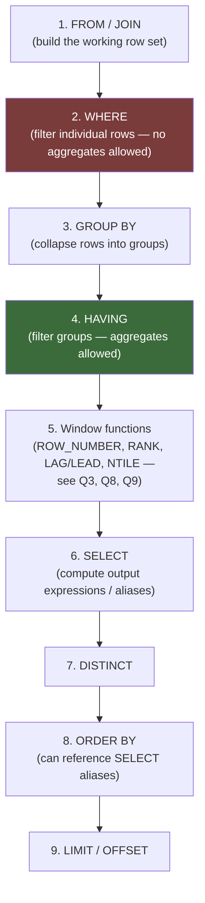

```sql
-- WRONG: WHERE cannot reference COUNT(*) because grouping hasn't happened yet
SELECT dept_id, COUNT(*)
FROM employees
GROUP BY dept_id
WHERE COUNT(*) > 2;   -- ❌ syntax error

-- CORRECT: HAVING filters after grouping
SELECT dept_id, COUNT(*) AS num_employees
FROM employees
GROUP BY dept_id
HAVING COUNT(*) > 2;  -- ✅ Engineering (4) and Sales (3)
```

---

### Q3 — ROW_NUMBER() vs RANK() vs DENSE_RANK()

**Table:** `emp_test` — intentionally has two rows with salary 4000 (B and C) to show tie behaviour.

| Function | Tie behaviour | Gaps after tie? |
|---|---|---|
| `ROW_NUMBER()` | Always unique — arbitrary order for ties | N/A |
| `RANK()` | Same rank for ties | Yes — skips the next number |
| `DENSE_RANK()` | Same rank for ties | No — continuous numbering |

**Why this matters:** window functions (the `OVER (...)` clause) let you compute a value across a *set of related rows* — a "window" — without collapsing those rows into one, the way `GROUP BY` would. `PARTITION BY` (not used in this simple example, but used implicitly by the single global window here) defines which rows belong to the same window; `ORDER BY` inside `OVER (...)` defines the order used to compute the ranking/offset for each row. This is what lets Q3, Q8, and Q9 answer "rank/percentile/previous value *within this group*" in a single pass over the table instead of a self-join or application-side loop.

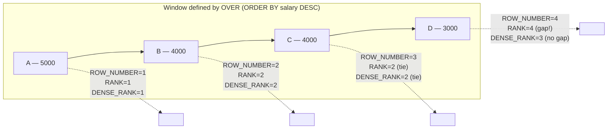

```sql
SELECT
    emp_name,
    salary,
    ROW_NUMBER()  OVER (ORDER BY salary DESC) AS row_num,
    RANK()        OVER (ORDER BY salary DESC) AS rnk,
    DENSE_RANK()  OVER (ORDER BY salary DESC) AS dense_rnk
FROM emp_test
ORDER BY salary DESC, emp_name;
```

**Expected output:**

```
emp_name | salary | row_num | rnk | dense_rnk
---------+--------+---------+-----+-----------
A        |  5000  |    1    |  1  |     1
B        |  4000  |    2    |  2  |     2
C        |  4000  |    3    |  2  |     2      ← same rank as B
D        |  3000  |    4    |  4  |     3      ← RANK skips 3; DENSE_RANK does not
```

---

### Q4 — Find the Nth Highest Salary

**Wrong approach:** `MAX(salary) WHERE salary < MAX(salary)` only finds the 2nd highest and is brittle.

**Correct approach:** `DENSE_RANK()` — handles ties properly. Replace `2` with your desired N.

```sql
-- Find the 2nd highest salary (N = 2)
SELECT emp_name, salary, dense_rnk
FROM (
    SELECT
        emp_name,
        salary,
        DENSE_RANK() OVER (ORDER BY salary DESC) AS dense_rnk
    FROM emp_test
) ranked
WHERE dense_rnk = 2;
-- Returns both B and C (both have salary 4000 = 2nd highest)
```

---

### Q5 — Nth Highest Salary with Index (Efficient)

Oracle uses `ROWNUM`; PostgreSQL uses `LIMIT`. The index `idx_emp_test_salary_desc` created in V3 lets the database avoid a full sort.

```sql
-- Index created in V3 migration:
-- CREATE INDEX idx_emp_test_salary_desc ON emp_test (salary DESC);

-- Find the 2nd highest distinct salary (N = 2)
SELECT MIN(salary) AS nth_highest_salary
FROM (
    SELECT DISTINCT salary
    FROM emp_test
    ORDER BY salary DESC
    LIMIT 2          -- take top-N distinct salaries, then MIN gives you the Nth one
) top_n;
-- Returns 4000
```

**Why MIN?** After `LIMIT 2`, the subquery contains `{5000, 4000}`. `MIN` of that set is `4000` = the 2nd highest.

---

### Q6 — Pivot Table (Rows → Columns)

Transform `(name, subject, score)` rows into `(name, math, science, english)` columns using conditional aggregation.

```sql
-- Original data in `scores`:
-- Aarav | Math    | 85
-- Aarav | Science | 90
-- ...

SELECT
    name,
    MAX(CASE WHEN subject = 'Math'    THEN score END) AS math,
    MAX(CASE WHEN subject = 'Science' THEN score END) AS science,
    MAX(CASE WHEN subject = 'English' THEN score END) AS english
FROM scores
GROUP BY name
ORDER BY name;
```

**Expected output:**

```
name  | math | science | english
------+------+---------+---------
Aarav |  85  |   90    |   78
Priya |  92  |   88    |   95
Rahul |  70  |   65    |   80
```

**Rule:** In a `GROUP BY` query, every column in `SELECT` must be either in `GROUP BY` or wrapped in an aggregate function (`MAX`, `MIN`, `SUM`, `COUNT`, etc.).

---

### Q7 — Swap Two Columns Without a Temp Table

PostgreSQL evaluates the entire right-hand side of `SET` before applying any assignments, so swapping in a single `UPDATE` is safe.

```sql
UPDATE employees
SET col_a = col_b,
    col_b = col_a;

-- Verify
SELECT emp_id, first_name, col_a, col_b FROM employees LIMIT 3;

-- Swap back
UPDATE employees
SET col_a = col_b,
    col_b = col_a;
```

> This works in PostgreSQL and MySQL 8+. In older MySQL or Oracle, you need a temporary variable.

---

### Q8 — NTILE() Function

`NTILE(N)` divides the result set into N equal buckets and assigns each row a bucket number.  
Common use: quartiles, percentiles, deciles.

```sql
-- Divide all employees into 4 salary quartiles
SELECT
    first_name,
    salary,
    NTILE(4) OVER (ORDER BY salary DESC) AS quartile
FROM employees
ORDER BY salary DESC;

-- quartile=1 → top earners, quartile=4 → lowest earners
```

---

### Q9 — LAG() and LEAD() Functions

`LAG(col, offset)` looks at the **previous** row; `LEAD(col, offset)` looks at the **next** row within the same window — without a self-join.

```sql
SELECT
    first_name,
    salary,
    LAG(first_name)  OVER (ORDER BY salary DESC) AS prev_emp_name,
    LAG(salary)      OVER (ORDER BY salary DESC) AS prev_salary,
    LEAD(first_name) OVER (ORDER BY salary DESC) AS next_emp_name,
    LEAD(salary)     OVER (ORDER BY salary DESC) AS next_salary
FROM employees
ORDER BY salary DESC;
```

**Expected output (top 4 rows):**

```
first_name | salary    | prev_emp_name | prev_salary | next_emp_name | next_salary
-----------+-----------+---------------+-------------+---------------+-------------
Eve        | 90000.00  | (null)        | (null)      | Frank         | 85000.00
Frank      | 85000.00  | Eve           | 90000.00    | Alice         | 80000.00
Alice      | 80000.00  | Frank         | 85000.00    | Bob           | 75000.00
Bob        | 75000.00  | Alice         | 80000.00    | Henry         | 70000.00
```

---

### Q10 — Find Restaurants with ≥ 4 Ratings and Never Rated Below 4

```sql
SELECT
    restaurant,
    COUNT(*)    AS total_ratings,
    MIN(rating) AS min_rating
FROM deliveries
GROUP BY restaurant
HAVING COUNT(*) >= 4
   AND MIN(rating) >= 4;
```

**Expected output:**

```
restaurant  | total_ratings | min_rating
------------+---------------+------------
Sushi Star  |       4       |     4       ← 4 ratings, all ≥ 4 ✅
```

**Why Pizza Palace is excluded:** It only has 3 ratings (`COUNT(*) = 3 < 4`).  
**Why Burger Barn is excluded:** It has a rating of 2 (`MIN(rating) = 2 < 4`).

---

## 5. Spring Data JPA Concepts

---

### 5.1 Spring Data Overview

Spring Data is an umbrella project providing a consistent programming model across different data stores (JPA, MongoDB, Redis, Cassandra, etc.).

**Benefits:**
- Eliminates boilerplate DAO/repository code
- Method-name-based query derivation (`findByFirstNameAndSalaryGreaterThan`)
- Consistent pagination, sorting, and auditing APIs

---

### 5.2 JPA vs Hibernate

| | JPA | Hibernate |
|---|---|---|
| What it is | Specification (Jakarta EE standard) | Implementation / Provider |
| Package | `jakarta.persistence.*` | `org.hibernate.*` |
| Other providers | EclipseLink, OpenJPA, DataNucleus | — |

> Always code against JPA interfaces. Only use Hibernate-specific features (`@SQLDelete`, `@Filter`, `@FilterDef`) when JPA has no equivalent.

---

### 5.3 CrudRepository vs JpaRepository

```
Repository
  └── CrudRepository          (save, findById, delete, count)
        └── PagingAndSortingRepository   (+ findAll(Sort), findAll(Pageable))
              └── JpaRepository          (+ flush, saveAndFlush, deleteInBatch, findAll(Example))
                    └── JpaSpecificationExecutor  (added separately via interface)
```

**Rule of thumb:** Extend `JpaRepository` — it includes everything from the hierarchy above plus Query By Example support.

---

### 5.4 Relationships & Associations

Every relationship has an **owning side** (holds the FK column, and is the side Hibernate actually issues `INSERT`/`UPDATE` statements for when the association changes) and an **inverse side** (declares `mappedBy` and is purely a read-time convenience — writing to it alone does nothing to the database). Getting this backwards is one of the most common JPA bugs: setting a value only on the inverse side of a relationship persists nothing, because Hibernate only looks at the owning side's FK field when deciding what SQL to generate.

The underlying relational rule is simple and predates ORMs entirely: **a foreign key column always lives on the "many" (or the referencing) side of a relationship.** JPA's owning/inverse distinction is just a mapping of that relational fact onto two Java classes that both want to reference each other.

#### @OneToOne — Bidirectional

```
jpa_user (id, name, email, address_id FK)  ←→  jpa_address (id, street, city, zip)
```

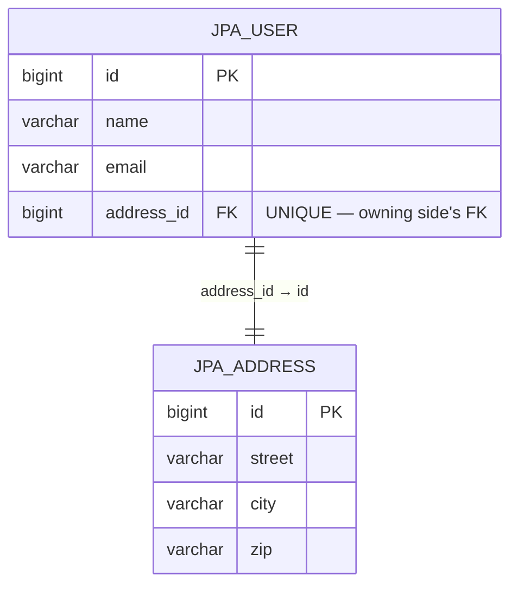

- `UserEntity` owns the FK (`address_id`) → owning side → has `@JoinColumn`
- `AddressEntity` is the inverse side → has `@OneToOne(mappedBy = "address")`
- The `unique = true` constraint on `@JoinColumn` is what turns a `@ManyToOne`-shaped FK into a true one-to-one — without it, PostgreSQL would happily let multiple users point at the same address row.

**Key files:** `UserEntity.java`, `AddressEntity.java`

```java
// Owning side (UserEntity)
@OneToOne(cascade = CascadeType.ALL, fetch = FetchType.LAZY)
@JoinColumn(name = "address_id", unique = true)
private AddressEntity address;

// Inverse side (AddressEntity)
@OneToOne(mappedBy = "address")
private UserEntity user;
```

#### @OneToMany / @ManyToOne — Bidirectional

```
jpa_customer (id, name, email)  ←→  jpa_order (id, product, amount, customer_id FK)
departments  (dept_id, name)    ←→  employees  (emp_id, ..., dept_id FK)
```

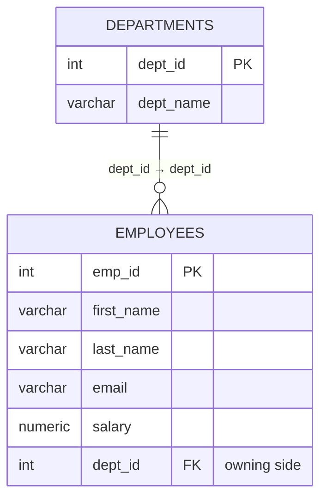

- `OrderEntity` / `EmployeeEntity` own the FK → **many side is always the owning side**
- `CustomerEntity` / `DepartmentEntity` are the inverse sides (use `mappedBy`)

```java
// CustomerEntity (inverse — one side)
@OneToMany(mappedBy = "customer", cascade = CascadeType.ALL, orphanRemoval = true)
private List<OrderEntity> orders = new ArrayList<>();

// OrderEntity (owning — many side)
@ManyToOne(fetch = FetchType.LAZY)
@JoinColumn(name = "customer_id")
private CustomerEntity customer;
```

#### @ManyToMany — Bidirectional

```
jpa_student ←→ jpa_student_course (student_id, course_id) ←→ jpa_course
```

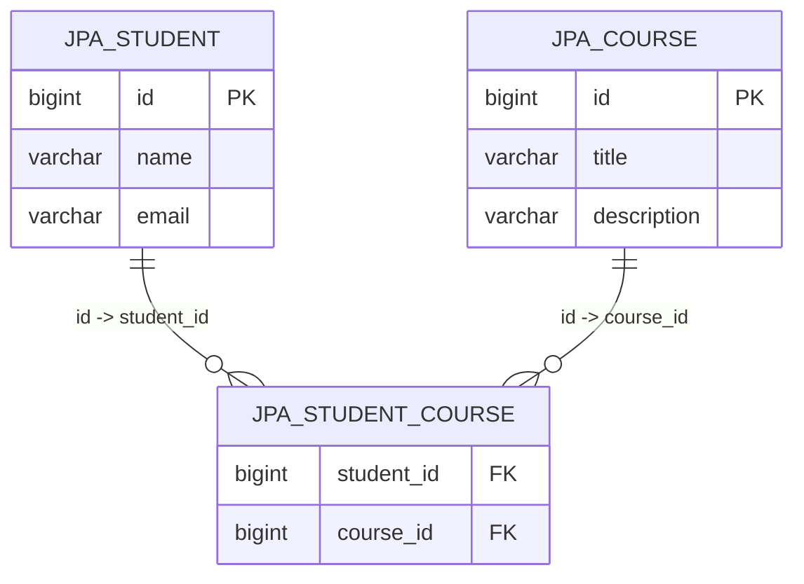

Unlike `@OneToOne`/`@OneToMany`, neither `jpa_student` nor `jpa_course` holds a foreign key — the relationship itself becomes a third table (`jpa_student_course`) whose composite primary key *is* the pair of foreign keys. Neither entity class maps directly to a row in that join table; Hibernate manages inserts/deletes into it transparently whenever you add or remove elements from the `courses`/`students` collections.

- One side defines `@JoinTable` (owning) — `StudentEntity`
- Other side uses `mappedBy` (inverse) — `CourseEntity`
- Avoid `CascadeType.REMOVE` on ManyToMany — removing a student would delete shared courses

```java
// StudentEntity (owning)
@ManyToMany(cascade = {CascadeType.PERSIST, CascadeType.MERGE})
@JoinTable(
    name = "jpa_student_course",
    joinColumns        = @JoinColumn(name = "student_id"),
    inverseJoinColumns = @JoinColumn(name = "course_id")
)
private List<CourseEntity> courses;

// CourseEntity (inverse)
@ManyToMany(mappedBy = "courses")
private List<StudentEntity> students;
```

---

### 5.5 Cascade Types

Cascade propagates state transitions from parent to child.

| CascadeType | What it does |
|---|---|
| `PERSIST` | Saving parent also saves new children |
| `MERGE` | Merging parent also merges children |
| `REMOVE` | Deleting parent also deletes all children |
| `REFRESH` | Refreshing parent also refreshes children |
| `DETACH` | Detaching parent also detaches children |
| `ALL` | All of the above (use with caution on ManyToMany!) |

> **Warning:** `CascadeType.ALL` on a `@ManyToMany` raises a red flag — deleting one student would delete all their enrolled courses, affecting other students.

Hibernate-specific extras: `REPLICATE`, `SAVE_UPDATE`, `LOCK`.

---

### 5.6 Fetch Types & N+1 Problem

| FetchType | Behaviour | Default for |
|---|---|---|
| `LAZY` | Associated entities loaded as proxies; DB hit only on first access | `@OneToMany`, `@ManyToMany` |
| `EAGER` | Associated entities loaded immediately with the parent | `@ManyToOne`, `@OneToOne` |

`LAZY` associations are backed by a runtime-generated proxy subclass (or a bytecode-instrumented field) — accessing `department.getEmployees()` for the first time is what triggers Hibernate to open a `Session` round-trip and populate the real collection. This is powerful (you only pay for what you use) and dangerous (the query happens implicitly, often deep inside a loop, far from where the collection was fetched) — which is exactly the shape of the N+1 problem below.

#### The N+1 Problem

```sql
-- 1 query to load all departments
SELECT * FROM departments;

-- N queries — one per department — to load its employees (if LAZY and accessed in a loop)
SELECT * FROM employees WHERE dept_id = 1;
SELECT * FROM employees WHERE dept_id = 2;
SELECT * FROM employees WHERE dept_id = 3;
SELECT * FROM employees WHERE dept_id = 4;
-- Total: 1 + 4 = 5 queries instead of 1
```

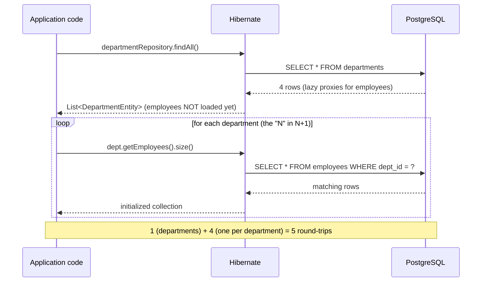

This repo demonstrates four different fixes for the same underlying problem, each with different trade-offs — see the comparison table in §5.29 for how `JOIN FETCH`, `@EntityGraph`, `@BatchSize`, and `@Fetch(SUBSELECT)` stack up against each other.

#### Solution: JOIN FETCH

```java
// DepartmentRepository.java
@Query("SELECT d FROM DepartmentEntity d LEFT JOIN FETCH d.employees")
List<DepartmentEntity> findAllWithEmployees();
// Result: 1 SQL query with a JOIN — no N+1
```

`JOIN FETCH` tells Hibernate to populate the association eagerly *for this query only*, using a single SQL `LEFT OUTER JOIN`, without changing the association's declared `FetchType`. The trade-off: the department row is duplicated once per employee in the result set (a classic join fan-out), so this is best for modestly sized collections — for large ones, `@BatchSize` or `@Fetch(SUBSELECT)` (§5.29) avoid the duplication.

---

### 5.7 @JoinColumn vs @JoinTable

| Annotation | Used for |
|---|---|
| `@JoinColumn` | Single FK column on the owning entity (`@OneToOne`, `@ManyToOne`) |
| `@JoinColumns` | Multiple FK columns forming a composite FK |
| `@JoinTable` | A separate join table (`@ManyToMany` or unidirectional `@OneToMany`) |

```java
// Single FK
@JoinColumn(name = "dept_id", referencedColumnName = "dept_id")

// Composite FK
@JoinColumns({
    @JoinColumn(name = "order_number", referencedColumnName = "orderNumber"),
    @JoinColumn(name = "branch_code",  referencedColumnName = "branchCode")
})

// Join table (ManyToMany)
@JoinTable(
    name = "jpa_student_course",
    joinColumns        = @JoinColumn(name = "student_id"),
    inverseJoinColumns = @JoinColumn(name = "course_id")
)
```

---

### 5.8 OrphanRemoval vs CascadeType.REMOVE

| | `CascadeType.REMOVE` | `orphanRemoval = true` |
|---|---|---|
| When triggered | Parent entity is deleted | Child is removed from the parent's collection |
| Scope | Deletes ALL children when parent is deleted | Deletes only the child that was de-referenced |

```java
// orphanRemoval in action
Customer customer = repo.findById(1L);
Order orderToRemove = customer.getOrders().get(0);
customer.removeOrder(orderToRemove);
// Hibernate issues DELETE for orderToRemove — orphanRemoval triggered
// The customer row is NOT deleted

// CascadeType.REMOVE in action
repo.delete(customer);
// Hibernate deletes the customer AND all its orders
```

---

### 5.9 Inheritance Strategies

Object-oriented inheritance and relational tables don't map onto each other naturally — a class hierarchy is a tree of "is-a" relationships, while a relational schema is a flat set of tables connected by foreign keys. JPA offers four different ways to bridge that gap, and this repo implements all four side by side specifically so their generated schemas and query behaviour can be compared directly rather than taken on faith.

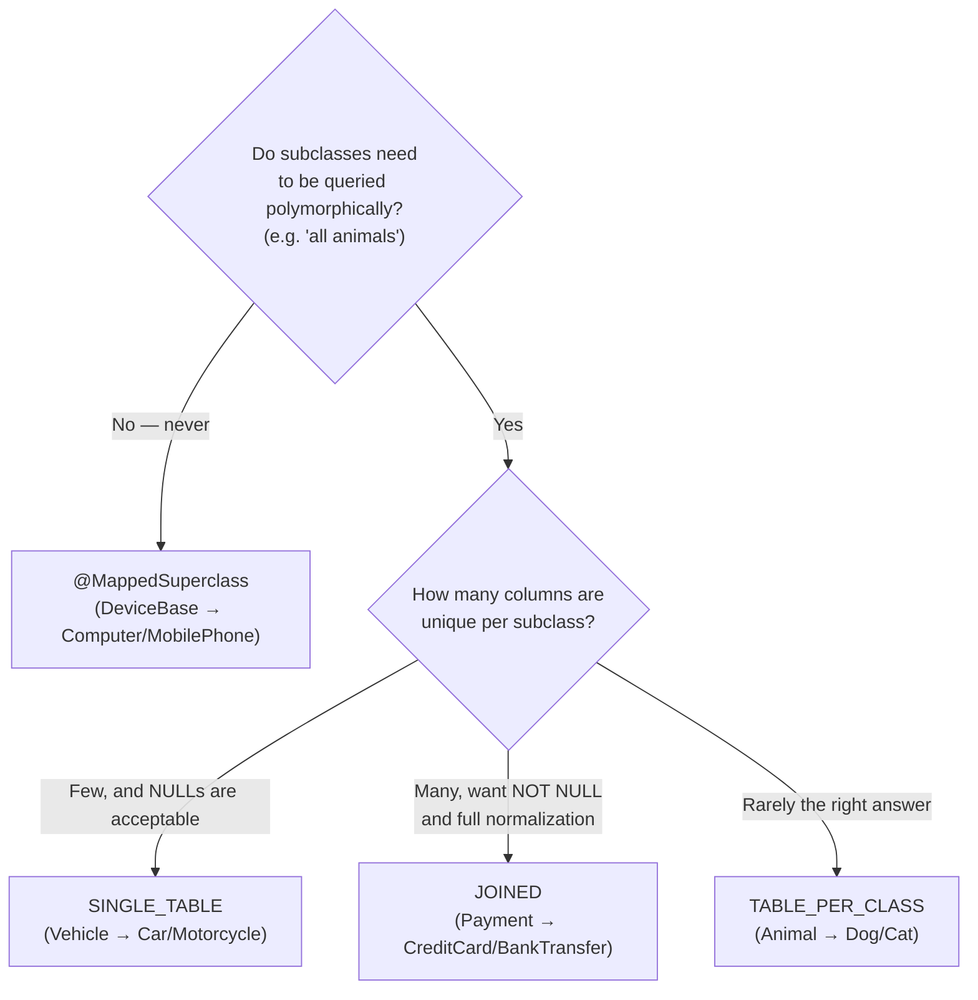

#### Strategy 1: @MappedSuperclass

No table for the parent. Each concrete subclass gets its own independent table with all parent + child columns.

```
computer    (id, brand, name, os)
mobile_phone(id, brand, name, color)
```

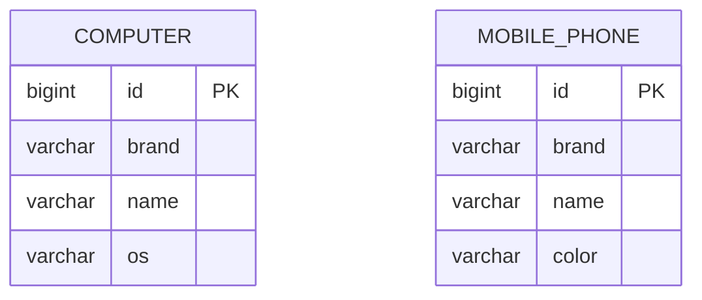

Notice `computer` and `mobile_phone` share no table, no FK, and no common column beyond duplicated definitions — `DeviceBase` never becomes a real table; its fields (`id`, `brand`, `name`) are just copy-pasted into each subclass's own `CREATE TABLE` by Hibernate at schema-generation time (or, here, hand-written identically in the migration).

- **Cannot** query polymorphically (`SELECT * FROM DeviceBase` is impossible)
- **Cannot** create FK relationships pointing at `DeviceBase`
- Best for sharing common fields (id, audit fields) without needing polymorphism

**File:** `DeviceBase.java` → `ComputerEntity.java`, `MobilePhoneEntity.java`

#### Strategy 2: SINGLE_TABLE

One table for the entire hierarchy. A discriminator column identifies the subclass.

```
vehicle (id, dtype, brand, model, num_doors, engine_capacity_cc)
```

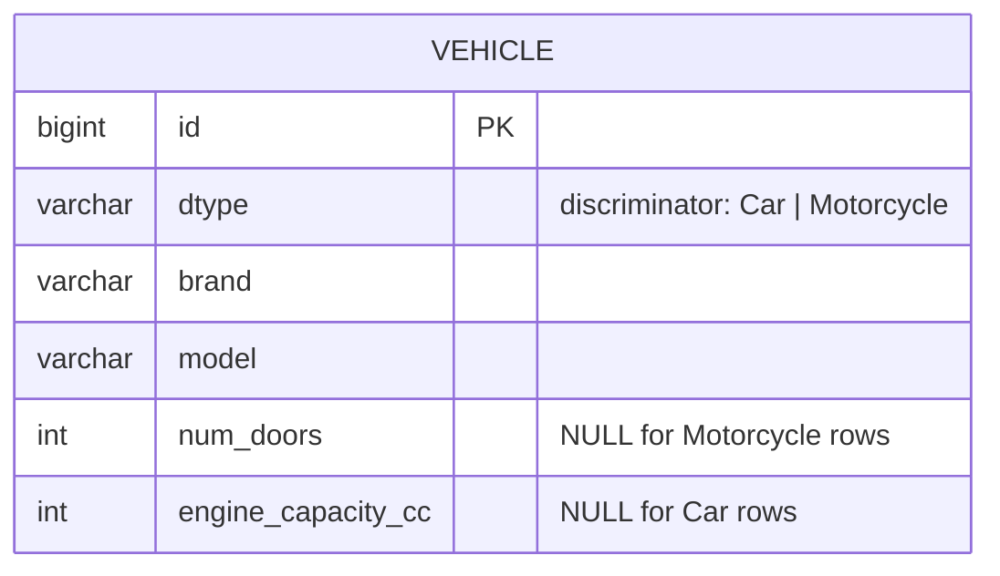

- `num_doors` is always NULL for motorcycles; `engine_capacity_cc` always NULL for cars
- **Fastest queries** — no JOINs needed
- **Cannot add NOT NULL** constraints on subclass-specific columns
- Best when subclasses have few unique fields

**File:** `VehicleEntity.java` → `CarEntity.java`, `MotorcycleEntity.java`

```java
@Inheritance(strategy = InheritanceType.SINGLE_TABLE)
@DiscriminatorColumn(name = "dtype")
public abstract class VehicleEntity { ... }

@DiscriminatorValue("Car")
public class CarEntity extends VehicleEntity { Integer numDoors; }
```

#### Strategy 3: JOINED

Parent table + a child table per subclass. Child PK is also a FK to the parent PK.

```
payment            (id, amount, payment_date, dtype)
credit_card_payment(id FK→payment, card_number, card_holder)
bank_transfer_payment(id FK→payment, bank_name, account_number)
```

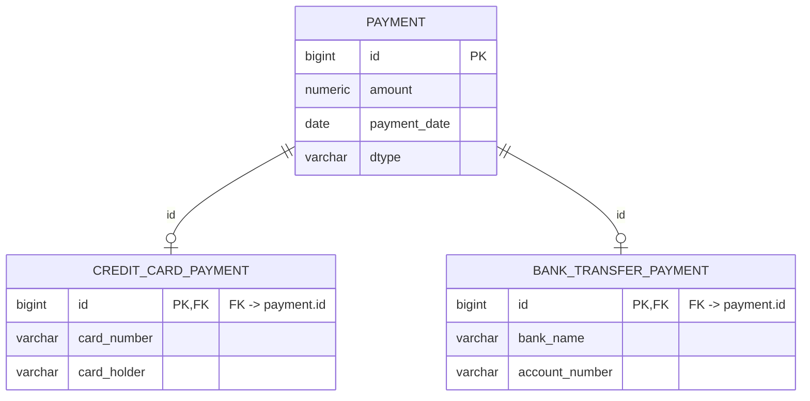

Loading a `CreditCardPaymentEntity` requires Hibernate to `JOIN payment ON payment.id = credit_card_payment.id` — this is the cost of full normalization: every subclass-specific column can be `NOT NULL`, but every read pays a join.

- All columns can have NOT NULL constraints
- Polymorphic queries require JOINs (slower than SINGLE_TABLE)
- Best for normalized schemas where subclasses have many unique fields

**File:** `PaymentEntity.java` → `CreditCardPaymentEntity.java`, `BankTransferPaymentEntity.java`

```java
@Inheritance(strategy = InheritanceType.JOINED)
public abstract class PaymentEntity { ... }

@PrimaryKeyJoinColumn(name = "id")
public class CreditCardPaymentEntity extends PaymentEntity { ... }
```

#### Strategy 4: TABLE_PER_CLASS

Each concrete subclass has its own full table (parent columns repeated in each).

```
dog (id, name, breed)       -- id comes from shared sequence `animal_seq`
cat (id, name, color)       -- id comes from shared sequence `animal_seq`
```

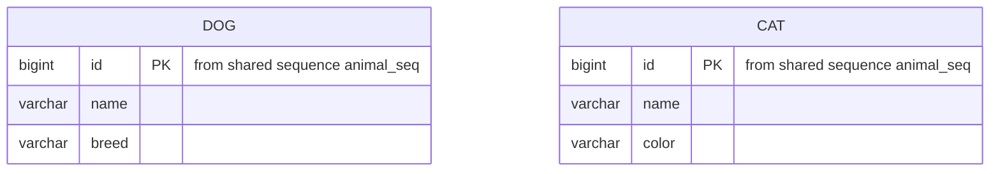

A polymorphic query such as `SELECT a FROM AnimalEntity a` cannot use a simple `JOIN` (there is no shared table) nor a discriminator column (there is no shared table for one to live on) — Hibernate is forced to generate a `SELECT ... FROM dog UNION ALL SELECT ... FROM cat`, re-executing and merging both tables' full contents on every polymorphic query.

- Polymorphic queries (`SELECT a FROM AnimalEntity a`) use `UNION ALL` — slow on large tables
- IDs must be globally unique across all subclass tables → use a shared sequence
- Rarely the best choice; prefer JOINED or SINGLE_TABLE

**File:** `AnimalEntity.java` → `DogEntity.java`, `CatEntity.java`

```java
@Inheritance(strategy = InheritanceType.TABLE_PER_CLASS)
public abstract class AnimalEntity {
    @GeneratedValue(strategy = GenerationType.SEQUENCE, generator = "animal_seq_gen")
    @SequenceGenerator(name = "animal_seq_gen", sequenceName = "animal_seq", allocationSize = 1)
    private Long id;
}
```

**Why the shared `animal_seq` sequence matters:** if `dog` and `cat` each used their own auto-increment/identity column, both tables could independently produce a row with `id = 1`. Since a polymorphic `UNION ALL` query merges rows from both tables into one JPA result set, two entities with the same id would be indistinguishable to client code (and to Hibernate's first-level cache, which is keyed by entity type + id — a collision here is scoped to the concrete subclass, but a shared sequence keeps ids globally unique as a matter of hygiene across the whole hierarchy).

#### Inheritance Strategy Comparison

| Strategy | Polymorphic queries | NOT NULL on subclass cols | JOINs needed | Schema complexity |
|---|---|---|---|---|
| `@MappedSuperclass` | ❌ No | ✅ Yes | ❌ No | Low |
| `SINGLE_TABLE` | ✅ Yes | ❌ No | ❌ No | Low |
| `JOINED` | ✅ Yes | ✅ Yes | ✅ Yes | Medium |
| `TABLE_PER_CLASS` | ✅ (UNION ALL) | ✅ Yes | ❌ No | High |

---

### 5.10 Projections

Fetch only the columns you need instead of loading entire entities.

#### Interface Projection (Spring Proxy)

Safest and most readable. Spring creates a dynamic proxy at runtime.

```java
// projection/EmployeeNameView.java
public interface EmployeeNameView {
    String getFirstName();
    String getLastName();

    @Value("#{target.firstName + ' ' + target.lastName}")  // SpEL expression
    String getFullName();
}

// EmployeeRepository.java
@Query("SELECT e.firstName AS firstName, e.lastName AS lastName FROM EmployeeEntity e")
List<EmployeeNameView> findEmployeeNames();
```

#### DTO / Record Projection (Constructor Expression)

Best for serialization and cross-layer transfer.

```java
// projection/EmployeeSummaryDTO.java
public record EmployeeSummaryDTO(String firstName, String lastName, BigDecimal salary) {
    public String fullName() { return firstName + " " + lastName; }
}

// EmployeeRepository.java
@Query("SELECT new com.learning.database.projection.EmployeeSummaryDTO(e.firstName, e.lastName, e.salary) FROM EmployeeEntity e")
List<EmployeeSummaryDTO> findEmployeeSummaries();
```

#### Tuple Projection

Flexible but not type-safe. Requires string-based alias lookup and casting.

```java
@Query("SELECT e.empId AS id, e.firstName AS firstName, e.salary AS salary FROM EmployeeEntity e")
List<Tuple> findEmployeeTuples();

// Usage
for (Tuple t : tuples) {
    Long id = t.get("id", Long.class);        // ← cast required
    String name = t.get("firstName", String.class);
}
```

**Drawback of Tuple:** No compile-time checking on alias names or types — a typo in `"firstName"` throws at runtime.

#### Native Query Projection

```java
@Query(nativeQuery = true, value = "SELECT * FROM employees WHERE last_name = :lastName")
List<EmployeeEntity> findByLastName(@Param("lastName") String lastName);
```

---

### 5.11 Dynamic Queries — JPA Specification

Used when query conditions are not known at compile time (search/filter APIs).

**Three parts:**
1. **Root** — the entity being queried (`FROM employees`)
2. **CriteriaQuery** — the overall query structure
3. **CriteriaBuilder** — creates predicates (`=`, `LIKE`, `BETWEEN`, etc.)

```java
// specification/ProductSpecification.java

public static Specification<ProductEntity> hasCategory(String category) {
    return (root, query, cb) ->
        category == null ? cb.conjunction()   // cb.conjunction() = TRUE = no-op filter
                         : cb.equal(root.get("category"), category);
}

public static Specification<ProductEntity> priceBetween(BigDecimal min, BigDecimal max) {
    return (root, query, cb) -> cb.between(root.get("price"), min, max);
}
```

**Composing specifications:**

```java
// service/ProductService.java
Specification<ProductEntity> spec = ProductSpecification.isNotDeleted()
        .and(ProductSpecification.hasCategory(category))
        .and(ProductSpecification.priceBetween(minPrice, maxPrice))
        .and(ProductSpecification.nameContains(keyword));

List<ProductEntity> results = productRepository.findAll(spec);
```

**Repository must extend `JpaSpecificationExecutor`:**

```java
public interface ProductRepository
        extends JpaRepository<ProductEntity, Long>,
                JpaSpecificationExecutor<ProductEntity> { }
```

**When NOT to use Specification:**
- Static queries with fixed parameters → use method naming or `@Query`
- Queries requiring DB-specific features (window functions, CTEs) → use native `@Query`

---

### 5.12 Dynamic Queries — Query By Example (QBE)

Simpler than Specification when your entity already has the fields you want to filter on. You fill in a partially-populated entity (Probe) and Spring builds the WHERE clause from non-null fields.

**Three parts:**
- **Probe:** a partially-filled entity instance
- **ExampleMatcher:** defines how fields are compared (case-insensitive, CONTAINS, ignore nulls, etc.)
- **Example:** `Example.of(probe, matcher)` — the final query spec

```java
// service/ProductService.java
EmployeeEntity probe = new EmployeeEntity();
probe.setFirstName("ali");   // only filter on firstName

ExampleMatcher matcher = ExampleMatcher.matchingAll()
        .withMatcher("firstName", ExampleMatcher.GenericPropertyMatchers.contains().ignoreCase())
        .withIgnoreNullValues()
        .withIgnorePaths("empId", "salary", "colA", "colB");

List<EmployeeEntity> results = employeeRepository.findAll(Example.of(probe, matcher));
// Generates: WHERE LOWER(first_name) LIKE '%ali%'
```

**Useful matcher methods:**

| Method | Effect |
|---|---|
| `.withIgnoreCase("field")` | Case-insensitive comparison |
| `.withIgnorePaths("field")` | Exclude this field from the WHERE clause |
| `.withIgnoreNullValues()` | Null probe fields = no filter (most common) |
| `.withNullHandler(INCLUDE)` | Null probe fields = `IS NULL` in WHERE |
| `.withStringMatcher(CONTAINING)` | Apply LIKE `%value%` to all String fields |

---

### 5.13 @Embeddable & @EmbeddedId (Composite Keys)

When a primary key spans multiple columns, use `@Embeddable` + `@EmbeddedId`.

```
jpa_order_item PK: (order_id, product_code)
```

```java
// entity/embeddable/OrderItemId.java
@Embeddable
public class OrderItemId implements Serializable {  // must be Serializable
    private Long orderId;
    private String productCode;
    // equals() and hashCode() are required — use @EqualsAndHashCode (Lombok) or write manually
}

// entity/embeddable/OrderItemEntity.java
@Entity
public class OrderItemEntity {
    @EmbeddedId
    private OrderItemId id;

    private Integer quantity;
    private BigDecimal price;
}
```

**Repository lookup with composite key:**

```java
// OrderItemRepository.java
public interface OrderItemRepository extends JpaRepository<OrderItemEntity, OrderItemId> {
    List<OrderItemEntity> findById_OrderId(Long orderId);  // navigate into embedded id
}

// Usage
OrderItemId key = new OrderItemId(1L, "LAP-001");
Optional<OrderItemEntity> item = repo.findById(key);
```

> **Alternative:** `@IdClass` — same result, but the key fields are duplicated on both the entity class and the ID class. `@EmbeddedId` is generally preferred because the key is a proper object you can pass around.

---

### 5.14 Spring Data Auditing

Automatically fills `createdBy`, `createdDate`, `lastModifiedBy`, `lastModifiedDate` on save/update, plus `@Version` for optimistic locking.

**Setup:**

```java
// config/AuditConfig.java
@Configuration
@EnableJpaAuditing(auditorAwareRef = "auditorAware")
public class AuditConfig {
    @Bean
    public AuditorAware<String> auditorAware() {
        // In production: read from SecurityContextHolder
        return () -> Optional.of("system");
    }
}
```

**Base class (extended by entities that need auditing):**

```java
// entity/common/AuditableBase.java
@MappedSuperclass
@EntityListeners(AuditingEntityListener.class)
public abstract class AuditableBase {
    @CreatedBy    private String createdBy;
    @CreatedDate  private LocalDateTime createdDate;
    @LastModifiedBy   private String lastModifiedBy;
    @LastModifiedDate private LocalDateTime lastModifiedDate;
    @Version      private Long version;   // optimistic locking
}
```

**`@Version` — Optimistic Locking:**  
Hibernate increments `version` on every UPDATE. If two transactions read the same row and both try to update it, the second one throws `OptimisticLockException` — no data is silently overwritten.

**`ProductEntity` extends `AuditableBase`** so every product save/update fills these fields automatically.

---

### 5.15 Soft Delete

Soft delete keeps rows in the database but marks them invisible with a `deleted = true` flag.

**Three annotations work together:**

```java
// entity/softdelete/ProductEntity.java

@SQLDelete(sql = "UPDATE product SET deleted = true WHERE id = ? AND version = ?")
// ↑ Overrides Hibernate's DELETE SQL. repo.deleteById(id) runs this UPDATE instead.

@FilterDef(name = "deletedProductFilter", parameters = @ParamDef(name = "isDeleted", type = Boolean.class))
// ↑ Declares the Hibernate filter and its parameter type.

@Filter(name = "deletedProductFilter", condition = "deleted = :isDeleted")
// ↑ Appends WHERE deleted = :isDeleted to all queries when the filter is enabled.
```

**Service usage — enable/disable the filter per request:**

```java
// service/ProductService.java
public List<ProductEntity> findActiveProducts() {
    Session session = entityManager.unwrap(Session.class);
    session.enableFilter("deletedProductFilter").setParameter("isDeleted", false);
    List<ProductEntity> products = productRepository.findAll();  // WHERE deleted = false
    session.disableFilter("deletedProductFilter");
    return products;
}
```

> Without enabling the filter, `findAll()` returns **all** rows including deleted ones. The filter must be explicitly activated per Session/request.

---

### 5.16 Paging, Sorting & Slicing

#### Page vs Slice

| | `Page<T>` | `Slice<T>` |
|---|---|---|
| Runs COUNT query | ✅ Yes | ❌ No |
| Knows total pages | ✅ Yes | ❌ No |
| Knows hasNext() | ✅ Yes | ✅ Yes |
| Best for | Traditional pagination UI | Infinite scroll / batch processing |

```java
// EmployeeRepository.java

// Page — useful when you need "Page 3 of 7"
Page<EmployeeEntity> findByDepartment_DeptId(Integer deptId, Pageable pageable);

// Slice — useful for "Load more" buttons (no total count needed)
Slice<EmployeeEntity> findByFirstName(String firstName, Pageable pageable);
```

**Service usage:**

```java
// Page with sorting
Pageable pageable = PageRequest.of(0, 10, Sort.by("salary").descending());
Page<EmployeeEntity> page = employeeRepository.findByDepartment_DeptId(1, pageable);

page.getContent();          // List<EmployeeEntity> for this page
page.getTotalElements();    // total rows matching the query
page.getTotalPages();       // total number of pages
page.getNumber();           // current page index (0-based)
page.hasNext();             // is there a next page?

// Slice — iterating through all results in batches
Slice<ProductEntity> slice = productRepository.findByCategory("Book", PageRequest.of(0, 10));
while (slice.hasNext()) {
    slice.getContent().forEach(product -> process(product));
    slice = productRepository.findByCategory("Book", slice.nextPageable());
}
```

---

### 5.17 Stored Procedures & DB Functions

Three ways to call stored procedures/functions in Spring Data JPA.

#### Method 1: @Query (nativeQuery) — Simplest for PostgreSQL functions

```java
// Works for any PostgreSQL function that returns a value
@Query(nativeQuery = true, value = "SELECT get_total_employees()")
Integer getTotalEmployeeCountNative();

@Query(nativeQuery = true, value = "SELECT get_employee_count_by_dept(:deptId)")
Integer getCountByDept(@Param("deptId") Integer deptId);
```

#### Method 2: @NamedStoredProcedureQuery + @Procedure (JPA 2.1)

```java
// On the entity class:
@NamedStoredProcedureQuery(
    name = "Employee.getTotalCount",
    procedureName = "get_total_employees",
    resultClasses = Integer.class
)
@Entity public class EmployeeEntity { ... }

// In the repository:
@Procedure(name = "Employee.getTotalCount")
Integer getTotalEmployeeCount();
```

#### Method 3: StoredProcedureQuery via EntityManager — For IN/OUT params

```java
// service/ProductService.java
StoredProcedureQuery query = entityManager.createStoredProcedureQuery("get_dept_salary_stats");
query.registerStoredProcedureParameter("p_dept_id", Integer.class,   ParameterMode.IN);
query.registerStoredProcedureParameter("p_min_sal", BigDecimal.class, ParameterMode.OUT);
query.registerStoredProcedureParameter("p_max_sal", BigDecimal.class, ParameterMode.OUT);
query.registerStoredProcedureParameter("p_avg_sal", BigDecimal.class, ParameterMode.OUT);

query.setParameter("p_dept_id", 1);
query.execute();

BigDecimal min = (BigDecimal) query.getOutputParameterValue("p_min_sal");
BigDecimal max = (BigDecimal) query.getOutputParameterValue("p_max_sal");
BigDecimal avg = (BigDecimal) query.getOutputParameterValue("p_avg_sal");
```

**Stored functions available (V9 migration):**

| Function | Parameters | Returns |
|---|---|---|
| `get_total_employees()` | — | `INTEGER` |
| `get_employee_count_by_dept(p_dept_id)` | `IN INTEGER` | `INTEGER` |
| `get_dept_salary_stats(p_dept_id, OUT min, OUT max, OUT avg)` | IN/OUT | `NUMERIC` × 3 |

---

### 5.18 JDBC — RowMapper, ResultSetExtractor, RowCallbackHandler

Three JDBC callback interfaces for different use cases.

**File:** `service/JdbcDemoService.java`

#### RowMapper — map each row to an object

```java
// Returns List<EmployeeRow>; Spring iterates the ResultSet for you
RowMapper<EmployeeRow> mapper = (rs, rowNum) -> new EmployeeRow(
        rs.getInt("emp_id"),
        rs.getString("first_name"),
        rs.getString("last_name"),
        rs.getDouble("salary")
);
List<EmployeeRow> employees = jdbcTemplate.query("SELECT * FROM employees", mapper);
```

**Use when:** Simple row-to-object mapping, get back a `List<T>`.

#### ResultSetExtractor — control the entire ResultSet

```java
// Returns a single complex object built from all rows
ResultSetExtractor<Map<String, List<String>>> extractor = rs -> {
    Map<String, List<String>> result = new LinkedHashMap<>();
    while (rs.next()) {
        result.computeIfAbsent(rs.getString("dept_name"), k -> new ArrayList<>())
              .add(rs.getString("full_name"));
    }
    return result;
};
Map<String, List<String>> deptMap = jdbcTemplate.query(sql, extractor);
// { "Engineering": ["Alice Murphy", "Bob Singh", ...], "Marketing": [...] }
```

**Use when:** Building a complex object from multiple related rows (e.g., dept → list of employees).

#### RowCallbackHandler — process rows with no return value

```java
// No return value — processes each row in-place (streaming / reporting)
RowCallbackHandler handler = rs -> System.out.printf("%-12s %.2f%n",
        rs.getString("first_name"), rs.getDouble("salary"));

jdbcTemplate.query("SELECT * FROM employees WHERE salary > ?", handler, 70000.0);
```

**Use when:** Processing very large result sets without loading everything into memory (streaming export, reporting).

#### Summary

| Callback | Returns | When to use |
|---|---|---|
| `RowMapper<T>` | `List<T>` | Simple row → object mapping |
| `ResultSetExtractor<T>` | Any single `T` | Complex multi-row aggregation |
| `RowCallbackHandler` | `void` | Streaming, no data stored in memory |

---

### 5.19 NamedParameterJdbcTemplate

Replaces positional `?` with named `:paramName` placeholders. More readable when queries have many parameters.

```java
// Dependency: included transitively via spring-boot-starter-data-jpa

String sql = """
    SELECT emp_id, first_name, last_name, salary
    FROM employees
    WHERE dept_id = :deptId AND salary > :minSalary
    ORDER BY salary DESC
    """;

Map<String, Object> params = Map.of("deptId", 1, "minSalary", 70000.0);

List<EmployeeRow> result = namedJdbc.query(sql, params, (rs, rowNum) ->
        new EmployeeRow(rs.getInt("emp_id"), rs.getString("first_name"),
                        rs.getString("last_name"), rs.getDouble("salary")));
```

---

### 5.20 Connection Pool (HikariCP)

Spring Boot uses **HikariCP** by default — "fast, simple, reliable, lightweight." A connection pool exists because opening a fresh TCP connection to PostgreSQL is expensive relative to running a query on it: PostgreSQL forks a new backend process per connection, negotiates SSL/auth, and initializes session state — work that would otherwise be repeated on every single request if the driver opened and closed a raw socket each time. A pool amortizes that cost by keeping a set of already-authenticated connections open and handing them out and back like a lending library.

Configuration in `application.yml` (this repo's actual settings, not illustrative values):

```yaml
spring:
  datasource:
    hikari:
      pool-name: learning-db-pool
      maximum-pool-size: 10           # max concurrent DB connections
      minimum-idle: 2                 # keep at least 2 alive at all times
      idle-timeout: 30000             # remove idle connection after 30s
      max-lifetime: 1800000           # max connection lifetime 30min (rotate before DB closes it)
      connection-timeout: 20000       # throw if no connection available after 20s
      leak-detection-threshold: 5000  # warn if a connection is held for > 5s (helps find leaks)
      auto-commit: true               # Spring manages transactions — default is fine
```

**How connection pooling works:**

```mermaid
sequenceDiagram
    participant Req as Request thread
    participant Pool as HikariCP Pool (max=10, min-idle=2)
    participant PG as PostgreSQL backend process

    Req->>Pool: getConnection()
    alt idle connection available
        Pool-->>Req: hand out existing connection (no new socket)
    else pool below maximum-pool-size
        Pool->>PG: open new TCP connection + authenticate
        PG-->>Pool: connection established
        Pool-->>Req: hand out new connection
    else pool exhausted (10 already checked out)
        Pool--xReq: block up to connection-timeout (20s), then throw
    end
    Req->>Req: run query / transaction
    Req->>Pool: connection.close()
    Note over Pool: NOT a real close — connection is\nreturned to the pool, socket stays open
    Pool->>Pool: idle-timeout (30s) evicts unused connections\nabove minimum-idle; max-lifetime (30min)\nforcibly rotates even busy ones
```

**`leak-detection-threshold: 5000`** — if a connection is checked out of the pool for longer than 5 seconds without being returned, HikariCP logs a warning with the stack trace of where it was borrowed. This exists because a forgotten `connection.close()` (or an exception path that skips it) permanently removes that connection from the pool — with a `maximum-pool-size` of 10, only 10 such leaks are needed to starve the entire application of database access.

**`ddl-auto: none` + `open-in-view: false`** (also in `application.yml`, and directly relevant to the topics above):
- `spring.jpa.hibernate.ddl-auto: none` — Hibernate is forbidden from creating or altering tables itself; Flyway (§3) is the single source of schema truth. Letting both Hibernate auto-DDL and Flyway manage the schema is a common source of drift and is deliberately avoided here.
- `spring.jpa.open-in-view: false` — by default Spring Boot keeps the Hibernate `Session` (and therefore a checked-out DB connection) open for the entire HTTP request, including view rendering, so that lazy associations can still be accessed after the `@Transactional` service method returns. This is the "Open Session In View" pattern, and it is disabled here deliberately: it hides N+1 queries (§5.6) inside the view layer, holds a pooled connection for the whole request instead of just the transactional portion, and turns `LazyInitializationException` (which should surface immediately, inside the service layer) into a much later, harder-to-diagnose failure. With it off, any lazy access outside the transaction fails fast, which is exactly why this repo uses `JOIN FETCH`, `@EntityGraph`, and DTO projections (§5.10, §5.21) rather than relying on lazy loading from a controller.

**Pool size rule of thumb:**
```
pool_size = (number_of_cores × 2) + number_of_disks
```
For a 4-core machine with 1 disk: start with `pool_size = 9`, tune from there.

**Other popular connection pools:**
- **C3P0** — older, not Spring Boot auto-configured
- **Tomcat JDBC** — `spring.datasource.type=org.apache.tomcat.jdbc.pool.DataSource`
- **Apache DBCP2** — `spring.datasource.type=org.apache.commons.dbcp2.BasicDataSource`
- **Oracle UCP** — best with Oracle DB; supports labelling, RAC failover, Application Continuity

### 5.21 @EntityGraph — Eager-Loading Graphs

**Problem it solves:** `JOIN FETCH` in JPQL eagerly loads an association, but it forces you to write a custom `@Query` — you lose the convenience of derived query method names. `@EntityGraph` decouples the fetch strategy from the query method, so you can write `findByFirstNameContaining(…)` and still get the join.

**Two forms:**

**Named EntityGraph (declared on the entity):**
```java
// Entity — declare the graph once
@NamedEntityGraph(
    name = "Employee.withDepartment",
    attributeNodes = @NamedAttributeNode("department")
)
@Entity
public class EmployeeEntity { ... }

// Repository — reference by name; Hibernate adds LEFT OUTER JOIN departments automatically
@EntityGraph("Employee.withDepartment")
List<EmployeeEntity> findByFirstNameContaining(String name);
```

**Ad-hoc EntityGraph (no declaration on the entity needed):**
```java
// attributePaths lists fields to eagerly fetch, using Java field names
@EntityGraph(attributePaths = {"department"})
Page<EmployeeEntity> findAll(Pageable pageable);
```

**Generated SQL (either form):**
```sql
SELECT e.*, d.*
FROM employees e
LEFT OUTER JOIN departments d ON e.dept_id = d.dept_id
WHERE e.first_name LIKE ?
```

**@EntityGraph vs JOIN FETCH — when to use each:**

| | `@EntityGraph` | `JOIN FETCH` in JPQL |
|---|---|---|
| Works with derived method names | Yes | No (needs custom `@Query`) |
| Works with `Pageable` | Yes (separate COUNT query) | No (Hibernate warns — in-memory pagination) |
| Flexibility | Limited to simple paths | Full JPQL control |
| Best for | Clean repo APIs | Complex multi-join queries |

**Files:** `EmployeeEntity.java` (lines 22–26), `EmployeeRepository.java` (lines 49–54)

---

### 5.22 @Lock — Pessimistic & Optimistic Locking

Concurrent transactions that both read then write the same row can produce **lost updates**: transaction A reads a row, transaction B reads the same row, A writes back its (now stale) change, B writes back its own stale change — silently overwriting A's update as if it never happened. Neither transaction saw an error; the data is simply wrong. Spring Data JPA exposes three locking modes via `@Lock` that each defend against this differently.

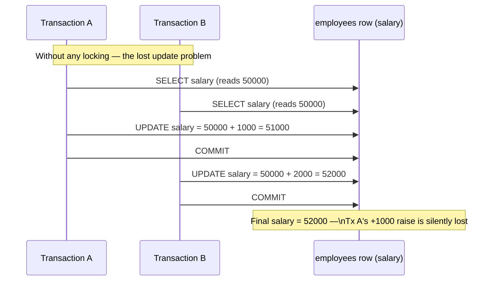

#### Pessimistic Write — `SELECT FOR UPDATE`

```java
@Lock(LockModeType.PESSIMISTIC_WRITE)
@Query("SELECT e FROM EmployeeEntity e WHERE e.empId = :id")
Optional<EmployeeEntity> findByIdForUpdate(@Param("id") Integer id);
```

Generated SQL:
```sql
SELECT * FROM employees WHERE emp_id = ? FOR UPDATE
```

The row is locked the moment it is read. Any other transaction attempting to read-for-update (or write) that row will **block** until this transaction commits or rolls back. Use this when two concurrent transactions are likely to update the same row — e.g. account balance transfers.

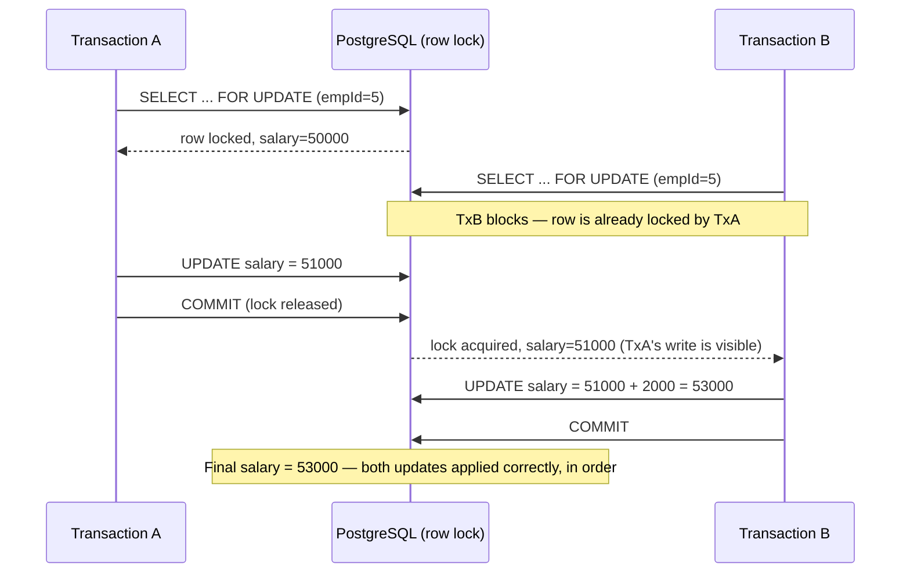

#### Pessimistic Read — `SELECT FOR SHARE`

```java
@Lock(LockModeType.PESSIMISTIC_READ)
@Query("SELECT e FROM EmployeeEntity e WHERE e.empId = :id")
Optional<EmployeeEntity> findByIdForShare(@Param("id") Integer id);
```

Generated SQL:
```sql
SELECT * FROM employees WHERE emp_id = ? FOR SHARE
```

Multiple readers can hold a shared lock simultaneously. Writers (FOR UPDATE) are blocked until all shared locks are released. Use when you want to prevent writes while allowing concurrent reads.

#### Optimistic — version-based conflict detection

```java
@Lock(LockModeType.OPTIMISTIC)
Optional<EmployeeEntity> findByEmail(String email);
```

No SQL-level lock is acquired at read time. Instead, Hibernate checks at commit time whether the `@Version` column changed since you read the row. If it did (another transaction updated the row), Hibernate throws `OptimisticLockException` and rolls back.

```java
// AuditableBase.java — the version field that powers optimistic locking
@Version
private Long version;
```

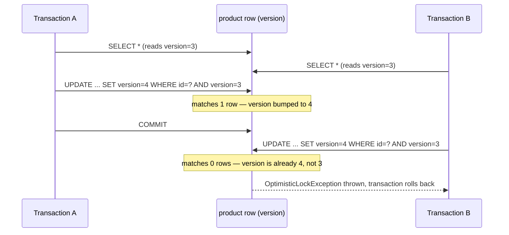

Hibernate implements this by silently appending `AND version = ?` to every `UPDATE`/`DELETE` it issues for a `@Version`-annotated entity, and checking the affected-row count: if it's zero, someone else committed a change since you read the row, and Hibernate raises `OptimisticLockException` instead of silently applying a stale write.

**Comparison:**

| | Pessimistic Write | Pessimistic Read | Optimistic |
|---|---|---|---|
| SQL lock | `FOR UPDATE` | `FOR SHARE` | None |
| Blocking | Yes | Only for writers | No |
| Failure point | At read (waits or times out) | At read | At commit (`OptimisticLockException`) |
| Best for | High-contention writes | Read-heavy, protect from writes | Low-contention, high-throughput |
| Requires `@Version` | No | No | Yes |

**Files:** `EmployeeRepository.java` (lines 56–84), `AuditableBase.java`

---

### 5.23 @Modifying — Bulk UPDATE / DELETE

`@Modifying` marks a non-SELECT `@Query` (UPDATE, DELETE, INSERT via native SQL). Without it, Spring Data throws an exception because it expects a SELECT.

**Why not just `save()` in a loop?**
- `findAll()` + modify + `saveAll()` loads every entity into the first-level cache, runs a dirty check per entity, and issues one UPDATE per entity.
- `@Modifying` issues a single SQL statement that the database executes in bulk — orders of magnitude faster for large sets.

```java
// Bulk salary raise for an entire department — one SQL UPDATE statement
@Modifying(clearAutomatically = true)
@Transactional
@Query("UPDATE EmployeeEntity e SET e.salary = e.salary * :multiplier WHERE e.department.deptId = :deptId")
int updateSalaryByDepartment(@Param("deptId") Integer deptId, @Param("multiplier") BigDecimal multiplier);

// Bulk soft-delete by category
@Modifying(clearAutomatically = true)
@Transactional
@Query("UPDATE ProductEntity p SET p.deleted = true WHERE p.category = :category")
int softDeleteByCategory(@Param("category") String category);

// Bulk hard-delete via native SQL — bypasses @SQLDelete interception
@Modifying
@Transactional
@Query(nativeQuery = true, value = "DELETE FROM product WHERE category = :category AND deleted = true")
int purgeDeletedByCategory(@Param("category") String category);
```

**`clearAutomatically = true`** — After the bulk UPDATE, the first-level cache (Hibernate's identity map) may hold stale snapshots of those entities. Setting this flag forces Hibernate to clear the cache so that any subsequent `findById(…)` re-queries the database rather than returning the stale cached version.

**`@Transactional` is required** — Spring Data repositories are not transactional by default for methods annotated with `@Query` that perform writes.

**JPQL vs Native SQL for `@Modifying`:**
- JPQL (`EmployeeEntity e SET e.salary`) — entity-level, respects type conversions and field mappings.
- Native (`nativeQuery = true`) — raw SQL, targets the actual table and column names. Bypasses Hibernate entity lifecycle, so `@SQLDelete` is NOT triggered.

**Files:** `EmployeeRepository.java` (lines 96–110), `ProductRepository.java` (lines 42–62)

---

### 5.24 @Transactional — Propagation, Isolation, rollbackFor, timeout

Spring's `@Transactional` is more than "wrap this in a transaction." It controls seven distinct behaviors: propagation, isolation, rollback rules, timeout, and read-only hint.

#### Propagation — what happens when a transactional method calls another

| Propagation | Behaviour |
|---|---|
| `REQUIRED` *(default)* | Join the caller's transaction if one exists. Create a new one otherwise. |
| `REQUIRES_NEW` | Always suspend the caller's transaction and start a brand new independent one. |
| `MANDATORY` | Must run inside an existing transaction. Throws `IllegalTransactionStateException` if none. |
| `SUPPORTS` | Join if one exists; run non-transactionally if not. |
| `NOT_SUPPORTED` | Always suspend any active transaction; run without one. |
| `NEVER` | Must NOT have an active transaction. Throws if one exists. |
| `NESTED` | Create a savepoint inside the existing transaction. Rollback goes to the savepoint, not the beginning. |

**The REQUIRES_NEW audit pattern** — a canonical use case:

```java
// TransactionDemoService.java
@Transactional
public void giveRaiseWithAudit(Integer deptId, BigDecimal multiplier) {
    int updated = employeeRepository.updateSalaryByDepartment(deptId, multiplier);
    // runs in REQUIRES_NEW → commits independently even if the outer tx throws
    auditLogService.log("Salary updated for " + updated + " employees in dept " + deptId);
    // throw new RuntimeException("Simulated failure");  // audit log still committed!
}

// AuditLogService.java
@Transactional(propagation = Propagation.REQUIRES_NEW)
public void log(String message) {
    // saved in its own transaction — survives outer rollback
}
```

The whole point of this pattern is that an audit trail must be trustworthy *especially* when the operation it's auditing failed. If `log()` simply joined the caller's transaction (the `REQUIRED` default), a rollback in `giveRaiseWithAudit` would erase the audit entry along with the salary update — the one situation where you most want a durable record of what was attempted.

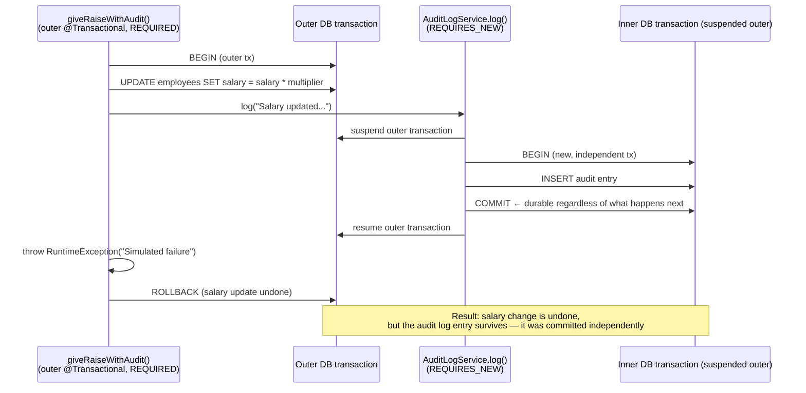

#### Isolation — what concurrent transactions can see

| Isolation Level | Dirty Read | Non-Repeatable Read | Phantom Read |
|---|---|---|---|
| `READ_UNCOMMITTED` | Possible | Possible | Possible |
| `READ_COMMITTED` *(PostgreSQL default)* | Prevented | Possible | Possible |
| `REPEATABLE_READ` | Prevented | Prevented | Possible |
| `SERIALIZABLE` | Prevented | Prevented | Prevented |

```java
@Transactional(isolation = Isolation.READ_COMMITTED, readOnly = true)
public List<EmployeeEntity> readCommittedExample() { ... }

@Transactional(isolation = Isolation.SERIALIZABLE)
public void serializableExample() { ... }
```

**Anomaly definitions:**
- **Dirty read** — you read a row another transaction has modified but not yet committed. If that transaction rolls back, your data never existed.
- **Non-repeatable read** — you read the same row twice in one transaction and get different values (another transaction committed a change between your two reads).
- **Phantom read** — you run the same range query twice and get different rows (another transaction inserted/deleted rows matching your predicate between reads).

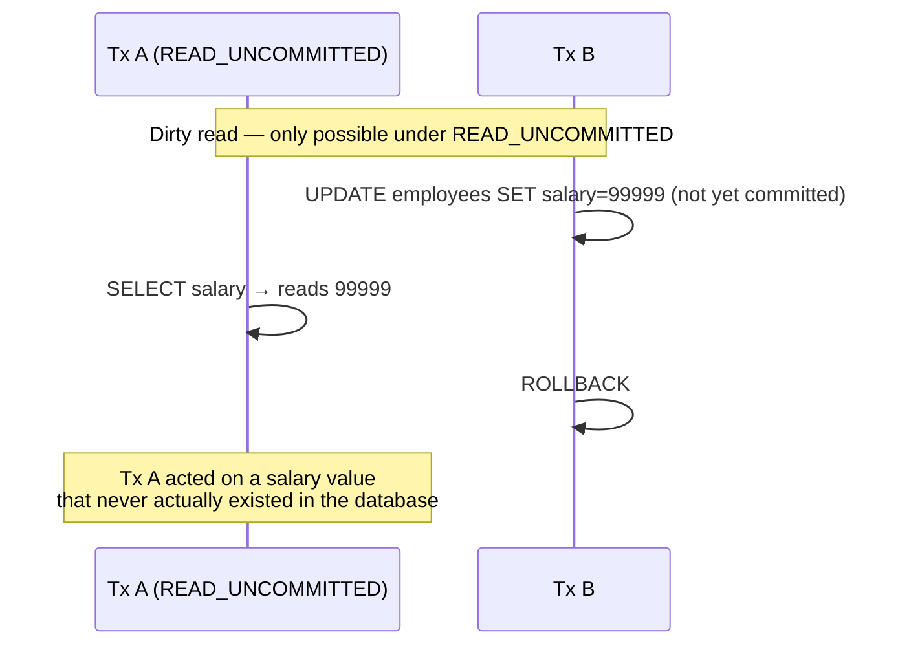

```mermaid
sequenceDiagram
    participant A as Tx A (READ_COMMITTED)
    participant B as Tx B
    Note over A,B: Non-repeatable read — possible under READ_COMMITTED
    A->>A: SELECT salary → reads 50000
    B->>B: UPDATE salary=60000; COMMIT
    A->>A: SELECT salary again → reads 60000
    Note over A: Same row, same transaction,<br/>two different values
```

```mermaid
sequenceDiagram
    participant A as Tx A (REPEATABLE_READ)
    participant B as Tx B
    Note over A,B: Phantom read — possible under REPEATABLE_READ
    A->>A: SELECT * FROM employees WHERE salary > 80000 → 3 rows
    B->>B: INSERT new employee (salary=90000); COMMIT
    A->>A: SELECT * FROM employees WHERE salary > 80000 again → 4 rows
    Note over A: Same predicate, same transaction,<br/>a new "phantom" row appeared
```

PostgreSQL is worth calling out specifically here: its `REPEATABLE_READ` is implemented via snapshot isolation (MVCC), which in practice also prevents phantom reads for the simple case above — PostgreSQL's `REPEATABLE_READ` is actually stricter than the SQL standard requires (it's closer to "snapshot isolation"). The standard's anomaly table above describes the *worst case a standard-conforming database is allowed to exhibit* at each level, not necessarily what every specific engine does — the four `Isolation` values are what Spring/JPA expose portably across databases, but always check your specific database's actual guarantees when it matters.

#### rollbackFor / noRollbackFor

Spring only rolls back on `RuntimeException` and `Error` by default. Checked exceptions commit.

```java
// Roll back even for checked exceptions
@Transactional(rollbackFor = Exception.class)
public void rollbackForCheckedExample() throws Exception { ... }

// Don't roll back for this specific exception — let the transaction commit
@Transactional(noRollbackFor = IllegalArgumentException.class)
public void noRollbackForExample(Integer empId) { ... }
```

#### timeout and readOnly

```java
@Transactional(timeout = 3)          // roll back if the tx runs > 3 seconds
public List<EmployeeEntity> timeoutExample() { ... }

@Transactional(readOnly = true)      // skip dirty checking; may route to read replica
public List<EmployeeEntity> readOnlyExample() { ... }
```

`readOnly = true` benefits:
- Hibernate skips dirty checking (no tracking what changed → faster).
- Some JDBC drivers route the connection to a read-replica.
- Acts as documentation — any accidental write will surface early in some providers.

**Files:** `TransactionDemoService.java`, `AuditLogService.java`

---

### 5.25 Window / ScrollPosition API (Keyset Pagination)

Introduced in **Spring Data JPA 3.1** (Spring Boot 3.1+). Provides cursor/keyset-based pagination as a first-class API, replacing the traditional `Page<T>` + OFFSET approach for performance-sensitive infinite-scroll scenarios.

#### The problem with OFFSET pagination

```sql
-- Page 100 of results (OFFSET = 100 * 10 = 1000)
SELECT * FROM employees ORDER BY salary DESC LIMIT 10 OFFSET 1000
```

The database must scan and discard the first 1000 rows on every page request. Cost is O(N) per page — gets exponentially slower as users scroll deeper.

#### Keyset pagination — O(1) per page

Instead of skipping rows, the cursor remembers the sort key value of the last seen row and uses it as a `WHERE` predicate:

```sql
-- First page
SELECT * FROM employees ORDER BY salary DESC LIMIT 10

-- Next page (cursor from last row: salary = 75000)
SELECT * FROM employees WHERE salary < 75000 ORDER BY salary DESC LIMIT 10
```

The `WHERE salary < ?` clause uses the index directly — no scanning, no skipping.

```mermaid
flowchart TB
    subgraph Offset["OFFSET pagination — cost grows with depth"]
        direction LR
        O1["Page 1\nOFFSET 0"] --> O2["Page 2\nOFFSET 10\n(scan+discard 10)"]
        O2 --> O3["Page 3\nOFFSET 20\n(scan+discard 20)"]
        O3 --> O100["Page 100\nOFFSET 1000\n(scan+discard 1000)"]
    end
    subgraph Keyset["Keyset (Window/ScrollPosition) — constant cost"]
        direction LR
        K1["Page 1\nWHERE none\n(index seek)"] --> K2["Page 2\nWHERE salary < 82000\n(index seek)"]
        K2 --> K3["Page 3\nWHERE salary < 75000\n(index seek)"]
        K3 --> K100["Page 100\nWHERE salary < X\n(index seek — same cost as page 1)"]
    end
```

#### Spring Data API

```java
// Repository
Window<EmployeeEntity> findTop10By(ScrollPosition position, Sort sort);
Window<ProductEntity>  findTop10ByDeletedFalse(ScrollPosition position, Sort sort);

// Service — first page
Window<EmployeeEntity> first = employeeRepository.findTop10By(
    ScrollPosition.keyset(),
    Sort.by(Sort.Direction.DESC, "salary")
);

// Service — next page
if (first.hasNext()) {
    ScrollPosition next = first.positionAt(first.size() - 1);
    Window<EmployeeEntity> second = employeeRepository.findTop10By(next, sort);
}
```

`Window<T>` is like `Slice<T>` but also holds `ScrollPosition` cursors for every element, enabling forward scrolling without maintaining external state.

**Offset ScrollPosition** — same API, uses traditional OFFSET internally:
```java
ScrollPosition position = ScrollPosition.offset(0);   // starts at beginning
Window<ProductEntity> page = productRepository.findTop10ByDeletedFalse(position, sort);
```

**Comparison:**

| | `Page<T>` | `Slice<T>` | `Window<T>` (keyset) |
|---|---|---|---|
| COUNT query | Yes | No | No |
| OFFSET scan | Yes | Yes | No — uses WHERE cursor |
| Performance at depth | O(N) | O(N) | O(1) |
| Random page access | Yes | No | No — forward only |
| Best for | Numbered pages | "Load more" | Infinite scroll on large tables |

**Files:** `EmployeeRepository.java` (lines 133–148), `ProductRepository.java` (line 33), `ProductService.java` (lines 99–137)

---

### 5.26 @SQLRestriction vs @Filter (Soft Delete Approaches)

Both approaches hide soft-deleted rows from queries, but with very different trade-offs.

#### @Filter (ProductEntity) — opt-in per session

```java
@Entity
@SQLDelete(sql = "UPDATE product SET deleted = true WHERE id = ? AND version = ?")
@FilterDef(
    name = "deletedProductFilter",
    parameters = @ParamDef(name = "isDeleted", type = Boolean.class)
)
@Filter(name = "deletedProductFilter", condition = "deleted = :isDeleted")
public class ProductEntity extends AuditableBase { ... }
```

The filter is **not active by default**. You must enable it per Hibernate `Session`:

```java
// Show only non-deleted rows
Session session = entityManager.unwrap(Session.class);
session.enableFilter("deletedProductFilter").setParameter("isDeleted", false);
List<ProductEntity> active = productRepository.findAll();
session.disableFilter("deletedProductFilter");

// Show only deleted rows (admin view)
session.enableFilter("deletedProductFilter").setParameter("isDeleted", true);
List<ProductEntity> deleted = productRepository.findAll();
session.disableFilter("deletedProductFilter");
```

The filter accepts a parameter so you can toggle between seeing active (`false`) or deleted (`true`) rows — useful for admin interfaces.

#### @SQLRestriction (StockItemEntity) — always-on

```java
@Entity
@SQLDelete(sql = "UPDATE stock_item SET deleted = true WHERE id = ?")
@SQLRestriction("deleted = false")   // appended to every SQL query automatically
public class StockItemEntity { ... }
```

`@SQLRestriction` (Hibernate 6.3+, replaces the deprecated `@Where`) appends the SQL condition to **every** query on this entity — no session configuration required. Deleted rows are always invisible.

To see deleted rows you would need raw JDBC or a native query — there is no session toggle.

#### When to use which

| | `@Filter` (ProductEntity) | `@SQLRestriction` (StockItemEntity) |
|---|---|---|
| Activation | Manual — `session.enableFilter()` | Automatic — always active |
| Runtime toggle | Yes | No |
| Can query deleted rows | Yes (enable with `isDeleted=true`) | No |
| Boilerplate | More (`@FilterDef` + `@ParamDef` + `@Filter`) | Minimal |
| Best for | Admin views that need both states | Simple apps where deleted = gone |

**`@SQLDelete` on both** — this annotation intercepts `repository.deleteById(id)` and replaces the SQL DELETE with an UPDATE. Without it, the row would be physically removed.

**Files:** `ProductEntity.java`, `StockItemEntity.java`, `ProductService.java` (lines 32–55)

---

### 5.27 @Convert / AttributeConverter

`@Convert` lets you control how a Java type is mapped to a database column. The most common use is converting enums to stable string values instead of fragile ordinals.

#### The problem with default enum mapping

By default, JPA maps an enum using its ordinal (0, 1, 2…):
```java
@Enumerated(EnumType.ORDINAL)  // default — stores 0, 1, 2
private Priority priority;
```

If you ever reorder the enum constants, existing rows silently hold the wrong value. `EnumType.STRING` is safer but stores the exact constant name — if you rename `LOW` to `LO`, existing DB rows break.

#### AttributeConverter — full control over the DB representation

```java
// Priority.java — each constant owns its DB value
public enum Priority {
    LOW("low"), NORMAL("normal"), HIGH("high");

    private final String dbValue;

    Priority(String dbValue) { this.dbValue = dbValue; }

    public static Priority fromDbValue(String dbValue) {
        for (Priority p : values()) {
            if (p.dbValue.equalsIgnoreCase(dbValue)) return p;
        }
        throw new IllegalArgumentException("Unknown: " + dbValue);
    }
}

// PriorityConverter.java
@Converter(autoApply = true)   // applies to ALL Priority fields without explicit @Convert
public class PriorityConverter implements AttributeConverter<Priority, String> {

    @Override
    public String convertToDatabaseColumn(Priority attribute) {
        return attribute == null ? null : attribute.getDbValue();  // Priority.HIGH → "high"
    }

    @Override
    public Priority convertToEntityAttribute(String dbData) {
        return dbData == null ? null : Priority.fromDbValue(dbData);  // "high" → Priority.HIGH
    }
}
```

Because `autoApply = true`, no explicit `@Convert` annotation is needed on entity fields:
```java
// ProductEntity.java — converter applied automatically
@Column(nullable = false)
private Priority priority = Priority.NORMAL;   // stored as "low"/"normal"/"high"
```

If `autoApply` were `false`, you would write:
```java
@Convert(converter = PriorityConverter.class)
private Priority priority;
```

**DB column contents:**
```
product table — priority column
"low"     → Priority.LOW
"normal"  → Priority.NORMAL
"high"    → Priority.HIGH
```

The converter is registered automatically by Spring; Hibernate calls `convertToDatabaseColumn` on every save and `convertToEntityAttribute` on every read.

**Files:** `Priority.java`, `PriorityConverter.java`, `ProductEntity.java` (line 63), `V10__additional_columns.sql`

---

### 5.28 @Formula — Computed Columns

`@Formula` is a Hibernate-specific annotation that maps a Java field to a SQL subquery (or expression) instead of a real DB column. The value is computed each time the entity is loaded — it has no DB column and is read-only.

```java
// DepartmentEntity.java
@Formula("(SELECT COUNT(*) FROM employees e WHERE e.dept_id = dept_id)")
private Integer employeeCount;
```

Generated SQL (Hibernate appends the subquery into the SELECT list):
```sql
SELECT
    d.dept_id,
    d.dept_name,
    (SELECT COUNT(*) FROM employees e WHERE e.dept_id = dept_id) AS employeeCount
FROM departments d
WHERE d.dept_id = ?
```

**Key rules:**
- The parentheses `(…)` are **required** — Hibernate inlines the expression literally.
- Column names inside `@Formula` are **SQL column names** (`dept_id`), not Java field names (`deptId`).
- No setter, no `@Column`, no DB migration needed.
- Cannot be used in JPQL `WHERE` clauses (it's not a real column). Use a native query if you need to filter on the value.
- For expensive subqueries on large tables, consider materialized views or a real column updated by a trigger instead.

**Use cases:**
- Computed aggregates (count of children, sum of line items)
- Derived fields (full name = first_name || ' ' || last_name)
- Lightweight denormalization without schema changes

**Files:** `DepartmentEntity.java` (line 45)

---

### 5.29 @BatchSize and @Fetch(FetchMode.SUBSELECT) — N+1 Alternatives

Section 5.6 introduced the N+1 problem and `JOIN FETCH` as the primary fix. `@BatchSize` and `@Fetch(SUBSELECT)` are two Hibernate-specific alternatives that work on the collection level without rewriting queries.

#### The N+1 problem — recap

```java
List<DepartmentEntity> depts = departmentRepository.findAll();   // 1 query
for (DepartmentEntity d : depts) {
    d.getEmployees().size();   // LAZY → triggers 1 query per department
}
// Total: 1 + N queries (N = number of departments)
```

#### @BatchSize — batches lazy loads into IN clauses

```java
// DepartmentEntity.java
@OneToMany(mappedBy = "department", fetch = FetchType.LAZY)
@BatchSize(size = 20)
private List<EmployeeEntity> employees = new ArrayList<>();
```

When you access `employees` on the first `DepartmentEntity`, Hibernate does not issue just one query. It gathers up to 20 uninitialized department IDs and fetches them all in a single `IN` clause:

```sql
-- Without @BatchSize: 4 queries (one per department)
SELECT * FROM employees WHERE dept_id = 1
SELECT * FROM employees WHERE dept_id = 2
SELECT * FROM employees WHERE dept_id = 3
SELECT * FROM employees WHERE dept_id = 4

-- With @BatchSize(size=20): 1 query
SELECT * FROM employees WHERE dept_id IN (1, 2, 3, 4)
```

With 100 departments and `@BatchSize(size=20)`, you get `ceil(100/20) = 5` queries instead of 100.

#### @Fetch(FetchMode.SUBSELECT) — one subquery for all

```java
@OneToMany(mappedBy = "department", fetch = FetchType.LAZY)
@Fetch(FetchMode.SUBSELECT)
private List<EmployeeEntity> employees = new ArrayList<>();
```

Hibernate loads all child collections for all parent entities in a single query using a subquery:

```sql
SELECT * FROM employees
WHERE dept_id IN (SELECT dept_id FROM departments WHERE <original parent query>)
```

All employees for all departments are loaded in one round-trip, regardless of how many departments there are.

#### Comparison

| Strategy | Extra queries | Memory | Notes |
|---|---|---|---|
| No mitigation (LAZY) | N | Low until access | Classic N+1 |
| `JOIN FETCH` | 0 | Higher (Cartesian join) | Best for small collections |
| `@BatchSize(size=20)` | ceil(N/20) | Moderate | Best general-purpose mitigation |
| `@Fetch(SUBSELECT)` | 1 | Higher (all at once) | Best for small parent sets |
| `@EntityGraph` | 0 | Higher (join) | Works with derived method names |

`@BatchSize` and `@Fetch(SUBSELECT)` cannot be combined on the same collection — choose one.

**Files:** `DepartmentEntity.java` (lines 60–63)

---

### 5.30 Jackson Serialization — @JsonManagedReference / @JsonBackReference / @JsonIgnoreProperties

Bidirectional JPA relationships cause infinite recursion when Jackson serializes them to JSON:  
`Department → employees[] → employee.department → Department → employees[] → …`

Spring provides three annotation approaches.

#### @JsonManagedReference / @JsonBackReference — for @OneToMany / @ManyToOne

The pair works like a directed reference: the "managed" side (the owner / parent) is serialized normally. The "back" side (the child) omits the field that points back up.

```java
// DepartmentEntity.java — "one" side
@OneToMany(mappedBy = "department", ...)
@JsonManagedReference("dept-employee")  // serialized: includes the employees list
private List<EmployeeEntity> employees = new ArrayList<>();

// EmployeeEntity.java — "many" side
@ManyToOne(fetch = FetchType.LAZY)
@JsonBackReference("dept-employee")     // NOT serialized: excluded from JSON output
private DepartmentEntity department;
```

**JSON output when serializing a Department:**
```json
{
  "deptId": 1,
  "deptName": "Engineering",
  "employees": [
    { "empId": 1, "firstName": "Alice" }   // no "department" field — cycle broken
  ]
}
```

The named label (`"dept-employee"`) links the pair. Multiple bidirectional relationships need distinct names.

**Limitation:** the "back" side (Employee) can no longer be serialized with its parent — `department` is always omitted. This is fine for OneToMany/ManyToOne but problematic for ManyToMany where both sides are equally valid roots.

#### @JsonIgnoreProperties — for @ManyToMany

For ManyToMany, both sides need to be serializable independently. `@JsonManagedReference` / `@JsonBackReference` cannot express this because they designate one side as always-primary.

`@JsonIgnoreProperties` instructs Jackson to skip the named property **of the target type** when it encounters it during serialization — preventing the loop without permanently suppressing either side.

```java
// StudentEntity.java
@ManyToMany
@JoinTable(...)
@JsonIgnoreProperties("students")   // when serializing a Course inside this list, skip "students"
private List<CourseEntity> courses;

// CourseEntity.java
@ManyToMany(mappedBy = "courses")
@JsonIgnoreProperties("courses")    // when serializing a Student inside this list, skip "courses"
private List<StudentEntity> students;
```

**JSON output when serializing a Student:**
```json
{
  "id": 1,
  "name": "Alice",
  "courses": [
    { "id": 1, "title": "Math" }    // no "students" array — cycle broken
  ]
}
```

**JSON output when serializing a Course independently:**
```json
{
  "id": 1,
  "title": "Math",
  "students": [
    { "id": 1, "name": "Alice" }    // no "courses" array — cycle broken
  ]
}
```

#### Summary

| Annotation | Relationship | Mechanism |
|---|---|---|
| `@JsonManagedReference` | OneToMany / parent side | Always serialized with child list |
| `@JsonBackReference` | ManyToOne / child side | Always excluded from JSON |
| `@JsonIgnoreProperties` | Either side of ManyToMany | Skips named property on the nested type |

**Files:** `DepartmentEntity.java` (line 63), `EmployeeEntity.java` (line 80), `CustomerEntity.java`, `OrderEntity.java`, `StudentEntity.java`, `CourseEntity.java`

---

### 5.31 JdbcTemplate.batchUpdate()

Spring's `JdbcTemplate.batchUpdate()` sends multiple SQL statements to the database in a single round-trip, avoiding the per-row overhead of calling `jdbcTemplate.update()` in a loop.

#### Simple batch INSERT (typed collection + setter)

```java
// Returns int[][] — outer array: one entry per chunk; inner: rows affected per statement
@Transactional
public int[][] batchInsertEmployees(List<NewEmployee> employees) {
    String sql = "INSERT INTO employees (first_name, last_name, salary, dept_id) VALUES (?, ?, ?, ?)";

    return jdbcTemplate.batchUpdate(sql, employees, 50,       // chunk size = 50
        (ps, emp) -> {
            ps.setString(1, emp.firstName());
            ps.setString(2, emp.lastName());
            ps.setDouble(3, emp.salary());
            ps.setInt(4, emp.deptId());
        });
}
```

The `(sql, collection, batchSize, setter)` overload automatically splits the list into chunks of `batchSize` and sends each chunk as one batch. The return type is `int[][]` — outer array has one element per chunk; inner array has one affected-row count per statement in that chunk.

#### Batch UPDATE via NamedParameterJdbcTemplate

```java
@Transactional
public int[] batchUpdateSalaries(Map<Integer, Double> empIdToNewSalary) {
    String sql = "UPDATE employees SET salary = :salary WHERE emp_id = :empId";

    SqlParameterSource[] batch = empIdToNewSalary.entrySet().stream()
        .map(entry -> new MapSqlParameterSource()
            .addValue("empId", entry.getKey())
            .addValue("salary", entry.getValue()))
        .toArray(SqlParameterSource[]::new);

    return namedJdbc.batchUpdate(sql, batch);   // returns int[] — one count per statement
}
```

Named parameters (`:salary`, `:empId`) are more readable than positional `?` for multi-parameter updates.

#### Batch UPDATE from JavaBeans via SqlParameterSourceUtils

```java
@Transactional
public int[] batchUpdateFromBeans(List<EmployeeRow> rows) {
    String sql = "UPDATE employees SET salary = :salary WHERE emp_id = :id";
    // createBatch introspects JavaBean properties and maps them to :name placeholders
    SqlParameterSource[] batch = SqlParameterSourceUtils.createBatch(rows);
    return namedJdbc.batchUpdate(sql, batch);
}
```

`SqlParameterSourceUtils.createBatch(list)` inspects the bean's getters (or record accessors) and maps them to named parameters automatically — no manual `MapSqlParameterSource` building.

**Return types:**
- `jdbcTemplate.batchUpdate(sql, list, chunkSize, setter)` → `int[][]`
- `namedJdbc.batchUpdate(sql, SqlParameterSource[])` → `int[]`

**When to use batch vs loop:**

| | Loop (`update()` per row) | `batchUpdate()` |
|---|---|---|
| Round-trips | N | ceil(N / chunkSize) |
| 10,000 rows | 10,000 DB calls | 200 calls at chunk=50 |
| `@Transactional` required | Yes (or auto-commit per row) | Yes |
| JPA dirty checking | N/A | N/A |

Also configure Hibernate batch settings in `application.yml` for `saveAll()` / `persist()` batching:
```yaml
spring.jpa.properties.hibernate:
  jdbc.batch_size: 50
  order_inserts: true    # group INSERT statements by entity type before sending
  order_updates: true
```

**Files:** `JdbcDemoService.java` (lines 109–152)
---

## 6. Database Schema Overview

The tables below fall into two families: the **interview-question schema** (`departments`, `employees`, `emp_test`, `scores`, `deliveries` — flat, denormalized, built purely to host the SQL problems in §4) and the **JPA-concept schema** (everything from `V6` onward — deliberately shaped to exercise a specific mapping feature per table group). Grouped by Flyway migration and by the JPA concept each group demonstrates:

#### Interview-question schema (V1–V5)

```mermaid
erDiagram
    DEPARTMENTS {
        int dept_id PK
        varchar dept_name
    }
    EMPLOYEES {
        int emp_id PK
        varchar first_name
        varchar last_name
        varchar email
        numeric salary
        varchar col_a "swap demo - Q7"
        varchar col_b "swap demo - Q7"
        int dept_id FK
    }
    EMP_TEST {
        varchar emp_name
        numeric salary "indexed DESC - Q5"
    }
    SCORES {
        int id PK
        varchar name
        varchar subject
        int score
    }
    DELIVERIES {
        int order_id PK
        varchar restaurant
        numeric amount
        int rating
    }
    DEPARTMENTS ||--o{ EMPLOYEES : "dept_id"
```

`emp_test`, `scores`, and `deliveries` are intentionally standalone (no FKs) — each exists purely to seed one interview problem (ranking ties for Q3–Q4, pivoting for Q6, `HAVING` with multiple aggregate conditions for Q10) with hand-crafted data.

#### JPA relationship schema (V6)

```mermaid
erDiagram
    JPA_ADDRESS {
        bigint id PK
        varchar street
        varchar city
        varchar zip
    }
    JPA_USER {
        bigint id PK
        varchar name
        varchar email
        bigint address_id FK "UNIQUE"
    }
    JPA_CUSTOMER {
        bigint id PK
        varchar name
        varchar email
    }
    JPA_ORDER {
        bigint id PK
        varchar product
        numeric amount
        bigint customer_id FK
    }
    JPA_STUDENT {
        bigint id PK
        varchar name
        varchar email
    }
    JPA_COURSE {
        bigint id PK
        varchar title
        varchar description
    }
    JPA_STUDENT_COURSE {
        bigint student_id FK
        bigint course_id FK
    }

    JPA_USER     ||--||     JPA_ADDRESS       : "address_id (1:1)"
    JPA_CUSTOMER ||--o{     JPA_ORDER          : "customer_id (1:N)"
    JPA_STUDENT  ||--o{     JPA_STUDENT_COURSE : "student_id (N:M)"
    JPA_COURSE   ||--o{     JPA_STUDENT_COURSE : "course_id (N:M)"
```

#### JPA inheritance schema (V7) — all four strategies side by side

```mermaid
erDiagram
    VEHICLE {
        bigint id PK
        varchar dtype "SINGLE_TABLE discriminator"
        varchar brand
        varchar model
        int num_doors "NULL for Motorcycle"
        int engine_capacity_cc "NULL for Car"
    }
    PAYMENT {
        bigint id PK
        numeric amount
        date payment_date
        varchar dtype "JOINED base"
    }
    CREDIT_CARD_PAYMENT {
        bigint id PK "FK to payment.id"
        varchar card_number
        varchar card_holder
    }
    BANK_TRANSFER_PAYMENT {
        bigint id PK "FK to payment.id"
        varchar bank_name
        varchar account_number
    }
    COMPUTER {
        bigint id PK
        varchar brand
        varchar name
        varchar os
    }
    MOBILE_PHONE {
        bigint id PK
        varchar brand
        varchar name
        varchar color
    }
    DOG {
        bigint id PK "shared animal_seq - TABLE_PER_CLASS"
        varchar name
        varchar breed
    }
    CAT {
        bigint id PK "shared animal_seq - TABLE_PER_CLASS"
        varchar name
        varchar color
    }

    PAYMENT ||--o| CREDIT_CARD_PAYMENT : "id"
    PAYMENT ||--o| BANK_TRANSFER_PAYMENT : "id"
```

`computer`/`mobile_phone` and `dog`/`cat` are deliberately disconnected in this diagram — that disconnection *is* the point (§5.9): `@MappedSuperclass` and `TABLE_PER_CLASS` both produce independent tables with no shared parent row to draw a relationship to.

#### Other JPA-concept tables (V8–V10)

```mermaid
erDiagram
    JPA_ORDER_ITEM {
        bigint order_id PK "composite key part 1"
        varchar product_code PK "composite key part 2"
        int quantity
        numeric price
    }
    PRODUCT {
        bigint id PK
        varchar name
        numeric price
        varchar category
        varchar priority "low/normal/high - via AttributeConverter"
        boolean deleted "true = soft-deleted"
        varchar created_by
        timestamp created_date
        timestamp last_modified_date
        bigint version "optimistic lock"
    }
    STOCK_ITEM {
        bigint id PK
        varchar name
        int stock
        boolean deleted "always hidden via @SQLRestriction"
    }
```

`jpa_order_item`'s primary key is the *pair* `(order_id, product_code)` — there is no surrogate `id` column, which is exactly what forces the `@EmbeddedId` mapping in §5.13. `product` and `stock_item` look almost identical (both soft-deletable) but demonstrate the two different soft-delete mechanisms compared in §5.26.

---

## 7. Connect to the Database

```bash
# psql CLI
psql -h localhost -U postgres -d learningdb

# Verify all tables exist
\dt

# Run the interview queries file
\i /path/to/interview-queries.sql
```

Or use a GUI client (DBeaver, DataGrip, TablePlus):

```
Host:     localhost
Port:     5432
Database: learningdb
User:     postgres
Password: postgres
```

---


---

*Generated for interview preparation — covers all topics in `learning-spring-boot-data.md` and `learning-db-FAQ.md`.*
