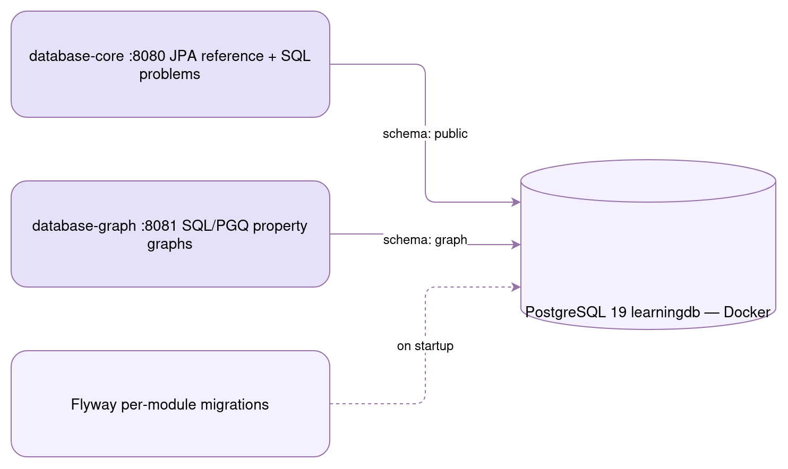

# <span style="color:hsl(12,80%,58%)">Learning Database</span>

 

A multi-module **Spring Boot + PostgreSQL 19 beta** learning project. One shared database (`learningdb`, started via Docker Compose), one module per topic — each module owns its own schema, Flyway migrations, and README.



## <span style="color:hsl(150,80%,58%)">Table of Contents</span>

1. 📦 [Modules](#1-modules)
2. 🚀 [Quick Start](#2-quick-start)
3. 🔌 [Database Connection](#3-database-connection)
4. 🏗️ [Repository Layout](#4-repository-layout)

---

<a id="1-modules"></a>
## <span style="color:hsl(287,80%,58%)">1. 📦 Modules</span>

| Module                                     | Port | Schema   | What it covers                                                                                                                                                                                                                                                                         |
|--------------------------------------------|------|----------|----------------------------------------------------------------------------------------------------------------------------------------------------------------------------------------------------------------------------------------------------------------------------------------|
| [database-core](database-core/README.md)   | 8080 | `public` | SQL interview query problems (window functions, pivot, Nth-highest salary …) and a complete Spring Data JPA reference: relationships, cascades, inheritance strategies, projections, Specifications, auditing, soft delete, locking, [`@Transactional`][Transactional], JDBC, HikariCP |
| [database-graph](database-graph/README.md) | 8081 | `graph`  | **SQL/PGQ** property graphs, available only in the PostgreSQL 19 betas up to 19beta3: `CREATE PROPERTY GRAPH`, `GRAPH_TABLE` / `MATCH` pattern queries, heterogeneous graphs, multiple labels, edge properties, and recursive-CTE fallbacks for variable-length paths                  |

> ⚠️ SQL/PGQ was [reverted from PostgreSQL 19 in 19beta4](https://www.postgresql.org/about/news/postgresql-19-beta-4-released-3386/) (September 2026) and will not ship in the 19 release, so `docker-compose.yml` stays pinned to `postgres:19beta3`. `database-core` itself needs nothing newer than PostgreSQL 14.

<a id="2-quick-start"></a>
## <span style="color:hsl(65,80%,50%)">2. 🚀 Quick Start</span>

Needs JDK 27 (the build compiles for release 27, inherited from super-pom 1.2.0), Maven 3.9+ and Docker.

```bash
# 1. Start PostgreSQL 19beta3 (shared by all modules)
docker compose up -d

# 2. Build everything
mvn clean install

# 3. Run a module (Flyway migrates its schema automatically)
mvn -pl database-core  spring-boot:run   # http://localhost:8080
mvn -pl database-graph spring-boot:run   # http://localhost:8081
```

<a id="3-database-connection"></a>
## <span style="color:hsl(202,80%,58%)">3. 🔌 Database Connection</span>

| Property | Value        |
|----------|--------------|
| Host     | `localhost`  |
| Port     | `5433` (host; container 5432) |
| Database | `learningdb` |
| Username | `postgres`   |
| Password | `postgres`   |

<a id="4-repository-layout"></a>
## <span style="color:hsl(340,80%,58%)">4. 🏗️ Repository Layout</span>

```
learning-database/
├── docker-compose.yml       ← PostgreSQL 19beta3 container (pinned: 19beta4 dropped SQL/PGQ)
├── interview-queries.sql    ← ready-to-run SQL for database-core
├── image/                   ← shared README assets
├── pom.xml                  ← parent aggregator POM
├── database-core/           ← SQL + Spring Data JPA deep dive
└── database-graph/          ← SQL/PGQ property graphs
```

Each module's README is the full documentation for its topic — start there.

<!-- Library classes mentioned above, linked to their source at the versions this project builds with. -->

[Transactional]: https://github.com/spring-projects/spring-framework/blob/v7.0.9/spring-tx/src/main/java/org/springframework/transaction/annotation/Transactional.java
