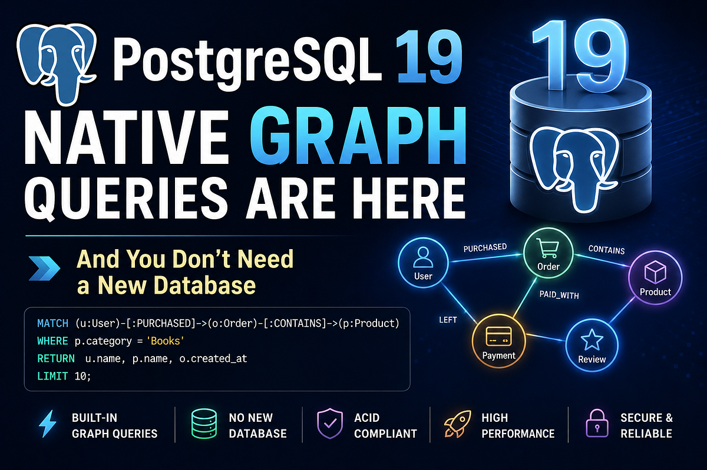

# database-graph — SQL/PGQ Property Graphs in PostgreSQL 19



A module of the [learning-database](../README.md) project demonstrating **SQL/PGQ** — the ISO/IEC 9075-16 (SQL:2023 Part 16) standard for querying graphs that live in regular relational tables — **natively available starting with PostgreSQL 19**.

> Based on [Handling graphs with SQL/PGQ in PostgreSQL (Cybertec)](https://www.cybertec-postgresql.com/en/handling-graphs-with-sql-pgq-in-postgresql/), [PostgreSQL 19: Native Graph Queries Are Here (Medium)](https://dataengg22.medium.com/postgresql-19-native-graph-queries-are-here-and-you-dont-need-a-new-database-5cab9295631a) and the [official PostgreSQL 19 property-graph docs](https://www.postgresql.org/docs/19/ddl-property-graphs.html).

---

## Table of Contents

1. 🕸️ [What is SQL/PGQ?](#1-what-is-sqlpgq)
2. 🚀 [Quick Start](#2-quick-start)
3. 🏗️ [Module Structure](#3-module-structure)
4. 🗄️ [Defining a Property Graph](#4-defining-a-property-graph)
5. 🔍 [Your First Graph Query](#5-your-first-graph-query)
6. 🔗 [Single-Hop and Multi-Hop Traversals](#6-single-hop-and-multi-hop-traversals)
7. ↔️ [Edge Directions: `->`, `<-`, `-`](#7-edge-directions)
8. 🧩 [Heterogeneous Graphs & Multiple Labels](#8-heterogeneous-graphs--multiple-labels)
9. 🧮 [Mixing GRAPH_TABLE with Classic SQL](#9-mixing-graph_table-with-classic-sql)
10. ⚙️ [Under the Hood — EXPLAIN](#10-under-the-hood--explain)
11. ⚠️ [Limitations in PostgreSQL 19](#11-limitations-in-postgresql-19)
12. 🌐 [REST Endpoints](#12-rest-endpoints)

---

<a id="1-what-is-sqlpgq"></a>
## 1. 🕸️ What is SQL/PGQ?

PostgreSQL 19 adds two SQL constructs:

| Construct               | Purpose                                                               |
|-------------------------|-----------------------------------------------------------------------|
| `CREATE PROPERTY GRAPH` | Defines a graph **as metadata** on top of existing tables             |
| `GRAPH_TABLE (...)`     | Queries that graph with Cypher-like `MATCH` patterns inside plain SQL |

Key design principles:

- **No extension is installed. No data is copied.** The graph is a read-only view over the joins between tables you already have, expressed in a syntax designed for that case.
- Vertices (nodes) come from *vertex tables*, edges (relationships) from *edge tables*. **Labels** categorize elements; **properties** expose columns (optionally renamed).
- Queries compile into ordinary joins planned by the regular optimizer — existing indexes, statistics, ACID guarantees, and tooling all apply.
- The syntax is **ISO-standard portable**, unlike Neo4j Cypher or Neptune Gremlin.

Two graphs are built in this module:

| Graph    | Migrations | Shape                                                                                                                   |
|----------|------------|-------------------------------------------------------------------------------------------------------------------------|
| `social` | `V1`, `V2` | Homogeneous: `person` vertices, `knows` edges — "friends of friends"                                                    |
| `myshop` | `V3`, `V4` | Heterogeneous: `customer` / `"order"` / `product` / `employee` vertices; `has_placed` / `contains` / `related_to` edges |

All objects live in the dedicated **`graph` schema** of `learningdb`, so this module never collides with `database-core` (which owns `public`).

<a id="2-quick-start"></a>
## 2. 🚀 Quick Start

```bash
# 1. Start PostgreSQL 19 (from the repository root)
docker compose up -d

# 2. Run this module (Flyway creates tables, seed data and both property graphs)
mvn -pl database-graph spring-boot:run

# 3. Try a graph query
curl "http://localhost:8081/api/graph/social/friends-of-friends?name=Alice"
```

<a id="3-module-structure"></a>
## 3. 🏗️ Module Structure

```
database-graph/
├── pom.xml
└── src/main/
    ├── resources/
    │   ├── application.yml                    ← port 8081, flyway schema "graph"
    │   └── db/migration/
    │       ├── V1__social_network_tables.sql  ← person + knows + seed data
    │       ├── V2__social_property_graph.sql  ← CREATE PROPERTY GRAPH social
    │       ├── V3__shop_tables.sql            ← customers/orders/products/… + seed
    │       └── V4__shop_property_graph.sql    ← CREATE PROPERTY GRAPH myshop
    └── java/com/learning/graph/
        ├── DatabaseGraphApplication.java
        ├── controller/GraphController.java    ← REST endpoints for every demo
        └── service/
            ├── SocialGraphService.java        ← homogeneous graph queries
            └── ShopGraphService.java          ← heterogeneous graph queries
```

Queries run through `JdbcTemplate` — Hibernate cannot parse `GRAPH_TABLE`, and it doesn't need to: the SQL is rewritten server-side.

<a id="4-defining-a-property-graph"></a>
## 4. 🗄️ Defining a Property Graph

Take the smallest possible social network — a `person` table and a `knows` table mapping who knows whom:

```sql
CREATE TABLE person (
    id   int  PRIMARY KEY,
    name text NOT NULL,
    age  int  NOT NULL,
    city text NOT NULL
);

CREATE TABLE knows (
    a     int NOT NULL REFERENCES person(id),
    b     int NOT NULL REFERENCES person(id),
    since int NOT NULL,
    PRIMARY KEY (a, b)
);
```

The property graph is defined on top ([V2](src/main/resources/db/migration/V2__social_property_graph.sql)):

```sql
CREATE PROPERTY GRAPH social
    VERTEX TABLES (
        person KEY (id)
            LABEL person PROPERTIES (id, name, age, city)
    )
    EDGE TABLES (
        knows KEY (a, b)
            SOURCE      KEY (a) REFERENCES person (id)
            DESTINATION KEY (b) REFERENCES person (id)
            LABEL knows PROPERTIES (since)
    );
```

Read it like a contract: all rows in `person` are vertices labelled `person`, exposing four columns as properties. Rows in `knows` are directed edges from `person(a)` to `person(b)`, exposing `since`.

Full syntax (from `\h CREATE PROPERTY GRAPH`):

```
CREATE [ TEMP | TEMPORARY ] PROPERTY GRAPH name
    [ {VERTEX|NODE} TABLES ( vertex_table_definition [, ...] ) ]
    [ {EDGE|RELATIONSHIP} TABLES ( edge_table_definition [, ...] ) ]

vertex_table_definition:
    vertex_table_name [ AS alias ] [ KEY ( column_name [, ...] ) ]
        [ element_table_label_and_properties ]

edge_table_definition:
    edge_table_name [ AS alias ] [ KEY ( column_name [, ...] ) ]
        SOURCE      [ KEY ( column_name [, ...] ) REFERENCES ] source_table [ ( column_name [, ...] ) ]
        DESTINATION [ KEY ( column_name [, ...] ) REFERENCES ] dest_table   [ ( column_name [, ...] ) ]
        [ element_table_label_and_properties ]

element_table_label_and_properties:
    NO PROPERTIES | PROPERTIES ALL COLUMNS | PROPERTIES ( expr [ AS name ] [, ...] )
  | { LABEL label_name | DEFAULT LABEL } [ ...properties... ] [...]
```

Notes:
- Every vertex/edge table needs a key (primary key, or explicit `KEY (...)`).
- `SOURCE`/`DESTINATION` keys can be inferred from foreign keys when unambiguous.
- Reserved words used as labels must be quoted (`LABEL "order"`).

<a id="5-your-first-graph-query"></a>
## 5. 🔍 Your First Graph Query

```sql
SELECT name
FROM GRAPH_TABLE (social
    MATCH (p IS person)
    COLUMNS (p.name)
)
ORDER BY name;
```

```
 name
-------
 Alice
 Bob
 Carol
 Dan
 Eve
 Frank
(6 rows)
```

Logically equivalent to `SELECT name FROM person ORDER BY name`. Gotchas:

- `COLUMNS` takes an explicit list — `COLUMNS (p.*)` fails with `ERROR: "*" is not supported here`.
- A `WHERE` clause may appear **inside** an element pattern — `(p IS person WHERE p.city = 'Berlin')` — or after the whole `MATCH`.

<a id="6-single-hop-and-multi-hop-traversals"></a>
## 6. 🔗 Single-Hop and Multi-Hop Traversals

**Who knows whom** — `(a)-[IS knows]->(b)` is an edge pattern; the arrow follows the edge in its declared direction (SOURCE → DESTINATION):

```sql
SELECT *
FROM GRAPH_TABLE (social
    MATCH (p IS person)-[k IS knows]->(p2 IS person)
    COLUMNS (p.name AS who, k.since AS since, p2.name AS knows)
);
```

**Friends of friends** — chain edge patterns for fixed-depth traversal, and use the in-graph `WHERE` to drop `Alice → Bob → Alice` cycles:

```sql
SELECT *
FROM GRAPH_TABLE (social
    MATCH (a IS person)-[IS knows]->
          (b IS person)-[IS knows]->(c IS person)
    WHERE a.id <> c.id
    COLUMNS (a.name AS a, b.name AS via, c.name AS c)
)
ORDER BY a, c, via;
```

```
   a   |  via  |   c
-------+-------+-------
 Alice | Carol | Bob
 Alice | Bob   | Carol
 Alice | Carol | Dan
 ...
(11 rows)
```

<a id="7-edge-directions"></a>
## 7. ↔️ Edge Directions

| Pattern               | Meaning                                                  |
|-----------------------|----------------------------------------------------------|
| `(a)-[IS knows]->(b)` | Follow edge in declared direction (source → destination) |
| `(a)<-[IS knows]-(b)` | Follow edge backwards (who points *at* `a`)              |
| `(a)-[IS knows]-(b)`  | Undirected — match the edge either way                   |

See `SocialGraphService.whoIsKnownBy()` and `.connections()` for both variants.

<a id="8-heterogeneous-graphs--multiple-labels"></a>
## 8. 🧩 Heterogeneous Graphs & Multiple Labels

Real graphs mix vertex types. The `myshop` graph ([V4](src/main/resources/db/migration/V4__shop_property_graph.sql)) exercises the full DDL feature set:

```sql
CREATE PROPERTY GRAPH myshop
    VERTEX TABLES (
        products KEY (product_no)
            LABEL product PROPERTIES (product_no, name, category, price),
        customers KEY (customer_id)
            LABEL customer PROPERTIES (customer_id, name, address)
            LABEL person   PROPERTIES (name),                    -- ← 2nd label
        orders KEY (order_id)
            LABEL "order" PROPERTIES (order_id, ordered_when),   -- ← quoted label
        employees KEY (employee_id)
            LABEL employee PROPERTIES (employee_id, department)
            LABEL person   PROPERTIES (employee_name AS name)    -- ← renamed property
    )
    EDGE TABLES (
        order_items KEY (order_items_id)
            SOURCE      KEY (order_id)   REFERENCES orders (order_id)
            DESTINATION KEY (product_no) REFERENCES products (product_no)
            LABEL contains PROPERTIES (quantity),
        customer_orders KEY (customer_orders_id)
            SOURCE      KEY (customer_id) REFERENCES customers (customer_id)
            DESTINATION KEY (order_id)    REFERENCES orders (order_id)
            LABEL has_placed NO PROPERTIES,                      -- ← no properties
        also_bought KEY (product_id, related_id)
            SOURCE      KEY (product_id) REFERENCES products (product_no)
            DESTINATION KEY (related_id) REFERENCES products (product_no)
            LABEL related_to PROPERTIES (weight)                 -- ← weighted, self-referencing
    );
```

Capabilities demonstrated:

- **Custom labels** — table name ≠ label name (`customer_orders` → `has_placed`).
- **Multiple labels per table** — `customers` and `employees` both carry `person`; the same label on different tables must expose matching properties (same name & type), hence `employee_name AS name`. `MATCH (p IS person)` then returns rows from **both** tables.
- **Cross-type paths** — customer → order → product in one pattern:

```sql
SELECT *
FROM GRAPH_TABLE (myshop
    MATCH (c IS customer)-[IS has_placed]->(o IS "order")
          -[i IS contains]->(p IS product)
    COLUMNS (c.name AS customer, o.order_id, p.name AS product, i.quantity, p.price)
);
```

- **Edge-property filters + recommendations** ("customers who bought X also bought Y", 2 hops over the weighted self-edge):

```sql
SELECT DISTINCT rec_name, rec_category
FROM GRAPH_TABLE (myshop
    MATCH (a IS product WHERE a.name = 'Wireless Headphones')
          -[e1 IS related_to WHERE e1.weight >= 0.5]->(b IS product)
          -[e2 IS related_to]->(c IS product)
    COLUMNS (c.name AS rec_name, c.category AS rec_category)
)
WHERE rec_name <> 'Wireless Headphones';
```

<a id="9-mixing-graph_table-with-classic-sql"></a>
## 9. 🧮 Mixing GRAPH_TABLE with Classic SQL

`GRAPH_TABLE` yields an ordinary row set, so CTEs, joins and aggregation compose naturally:

```sql
WITH spend AS (
    SELECT customer, SUM(price * quantity) AS total
    FROM GRAPH_TABLE (myshop
        MATCH (c IS customer)-[IS has_placed]->(o IS "order")
              -[i IS contains]->(p IS product)
        COLUMNS (c.name AS customer, i.quantity AS quantity, p.price AS price)
    )
    GROUP BY customer
)
SELECT c.name, COALESCE(s.total, 0) AS total_spend
FROM customers c
LEFT JOIN spend s ON s.customer = c.name
ORDER BY total_spend DESC;
```

<a id="10-under-the-hood--explain"></a>
## 10. ⚙️ Under the Hood — EXPLAIN

`EXPLAIN` on the friends-of-friends query shows **no graph executor nodes** — only ordinary hash joins over `person` and `knows`:

```
 Sort  (cost=575.72..588.55 rows=5132 width=96)
   Sort Key: person.name, person_2.name, person_1.name
   ->  Hash Join
         Hash Cond: (knows_1.b = person_2.id)
         Join Filter: (person.id <> person_2.id)
         ->  Hash Join
               Hash Cond: (knows.b = person_1.id)
               ->  Hash Join
                     Hash Cond: (knows.a = person.id)
                     ->  Seq Scan on knows
                     ->  Hash → Seq Scan on person
               ...
```

PostgreSQL simply rewrites the graph pattern into joins behind the scenes. You get more compact, intention-revealing syntax — and the `CREATE PROPERTY GRAPH` statement doubles as documentation of your data model. Try it live: `GET /api/graph/social/explain`.

<a id="11-limitations-in-postgresql-19"></a>
## 11. ⚠️ Limitations in PostgreSQL 19

- **Fixed-depth patterns only.** Variable-length quantifiers (`+`, `*`, `{2,5}`), shortest-path and flood-fill are **not** yet supported — planned for future releases. Open-ended traversals still need a recursive CTE (see `SocialGraphService.reachable()`):

```sql
WITH RECURSIVE reachable AS (
    SELECT k.b AS id, 1 AS depth
    FROM knows k JOIN person s ON s.id = k.a
    WHERE s.name = 'Alice'
    UNION ALL
    SELECT k.b, r.depth + 1
    FROM knows k JOIN reachable r ON k.a = r.id
    WHERE r.depth < 4
)
SELECT DISTINCT p.name, MIN(r.depth) AS depth
FROM reachable r JOIN person p ON p.id = r.id
GROUP BY p.name;
```

- `COLUMNS (p.*)` is not supported — properties must be listed explicitly.
- Property graphs are **read-only views**; you still modify data through the underlying tables.
- For billion-edge workloads and advanced graph algorithms (PageRank, community detection), dedicated graph databases remain the better tool.

<a id="12-rest-endpoints"></a>
## 12. 🌐 REST Endpoints

| Endpoint                                                                          | Demonstrates                              |
|-----------------------------------------------------------------------------------|-------------------------------------------|
| `GET /api/graph/social/persons`                                                   | Simplest vertex-only `MATCH`              |
| `GET /api/graph/social/knows`                                                     | Single hop + edge property                |
| `GET /api/graph/social/friends-of-friends?name=Alice`                             | Two hops, in-pattern & in-graph `WHERE`   |
| `GET /api/graph/social/known-by?name=Alice`                                       | Reversed arrow `<-`                       |
| `GET /api/graph/social/connections?name=Alice`                                    | Undirected edge `-`                       |
| `GET /api/graph/social/reachable?name=Alice&maxDepth=4`                           | Recursive-CTE fallback for variable depth |
| `GET /api/graph/social/explain`                                                   | Query plan — graph rewritten to joins     |
| `GET /api/graph/shop/customer-orders`                                             | Heterogeneous hop, quoted label `"order"` |
| `GET /api/graph/shop/order-contents`                                              | Three vertex types in one path            |
| `GET /api/graph/shop/persons`                                                     | Multi-label match across two tables       |
| `GET /api/graph/shop/recommendations?product=Wireless%20Headphones&minWeight=0.5` | Weighted self-edge, edge-property filter  |
| `GET /api/graph/shop/top-customers`                                               | `GRAPH_TABLE` inside CTE + aggregation    |
